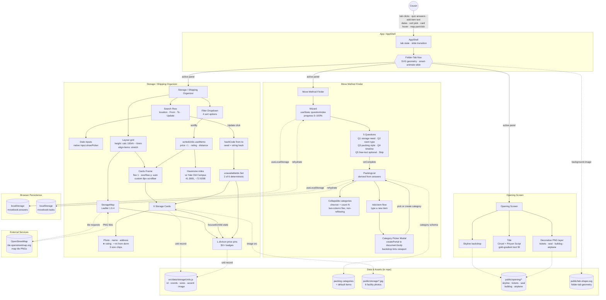

# Persons Required — The Move Book
**SCAD AI 201 — Project 3 (Capstone)**

> A tool built for one real person, one real problem.

---

## Design Argument

*The pre-AI document: who the Person is, what the Problem is, what "helped" looks like, the Qualification, and the Non-Negotiables. Student-authored.*

**TBD.**

---

## Research Documentation

*Evidence gathered about the Person, the Problem, and the surrounding context — interviews, observations, references, alternatives surveyed. Student-authored.*

**TBD.**

---

## Platform Rationale

*The chosen delivery format (web app, native app, print, physical artifact, etc.) and why it fits this Person and this Problem better than the alternatives — the connective tissue between the Person's situation, the Problem's shape, and the specific choices made in the prototype. Student-authored.*

**TBD.**

---

## AI Direction Log

*Decisions where AI was directed, with what was asked for, what came back, and what was kept or changed. Covers the full arc from pipeline setup to last-mile polish.*

| # | Date | Prompt | AI Output | Decision | Notes |
|---|------|--------|-----------|----------|-------|
| 1 | 2026-05-13 | "Hosting a Vite app in this folder, GitHub Pages via Actions. Do not build anything until I give you documentation." | Asked for assignment docs first, saved them to `claude/docs/`. Then set up Vite 5.4 + React 18.3 (JS, not TS — matches P1/P2), `vite.config.js` with `base: '/PersonsRequired/'`, and a GitHub Actions workflow that deploys to Pages on push to `main`. | **Kept** | Foundation for everything that followed. |
| 2 | 2026-05-13 | "Build out in high-fi and with animation" + 21 Figma screenshots across three surfaces. | Scaffolded all three surfaces in one pass — `AppShell` with tab nav, three panel components, design tokens, base CSS, Cinzel + Pinyon Script + Cormorant Garamond + Inter type system, navy/gold/cream palette. | **Kept (structure) / Revised (contents)** | ~40 pixel-level iterations followed — image positions, scale, font sizes, spacing. |
| 3 | 2026-05-13 | "You forgot the quiz entirely. It should be that they take the quiz and then it generates the 'personalized' recommended list." | Rebuilt MMF as a 5-step `Wizard` (storage need → room type → packing style → timeline → optional free-text) with progress bar, single-select toggle, back-clears-Q1, Skip on Q5. Quiz output drives the packing list contents. | **Revised** | Without the quiz the list is generic — same as the cousin's Notes app. Quiz is what makes it hers. |
| 4 | 2026-05-13 | "It feels a bit overwhelming looking at all the items. Make it a drop down. Display the number of items in each category in parentheses." | Wrapped categories in `
`-style collapsibles with chevron + `(N)` count. First used CSS `columns: 2` — caused right column to reflow when left expanded. Replaced with two independent flex columns (even-index left, odd-index right). | **Revised** | Two iterations: first the dropdown, then the non-reflowing column fix. |
| 5 | 2026-05-13 | "When you add an item and the pop up shows up, it should be just the pop up that shows with the background tinted." | First rendered inline `position: fixed` — backdrop didn't reach viewport edges because `.shell__panel` ancestor had a `transform` (creates a containing block for fixed-positioned descendants). Re-rendered via `createPortal(..., document.body)`. | **Revised** | Platform-specific React/CSS gotcha worth documenting. |
| 6 | 2026-05-13 | Folder-tab shape feedback over many rounds ("the bottom is cut off bruh", "still not quite"). | First tried CSS `clip-path: polygon(...)`; polygons can't represent concave-with-tails without faceting. Switched to SVG (`public/tab-shape.svg`) as `background-image` with `preserveAspectRatio="none"` and cropped `viewBox`. Fixed inverted arc sweep-flag (`0` → `1`) so top corners convex. | **Revised** | High iteration cost, but final result is one SVG file driving every tab state. |
| 7 | 2026-05-13 | "The map is too small and not built out fully so it just looks like the user is moving a picture." | Replaced CSS-art map wholesale with Leaflet 1.9.4 + OpenStreetMap tiles (no API key, no signup). | **Kept** | Bundle 170 → 320 KB. First and only new npm dep since project setup. Real geography for someone moving to an unfamiliar city. |
| 8 | 2026-05-13 | "Can we add pictures to the storage units to replace the placeholders." Person provided 6 PNGs mapped per facility. | Compressed PNG → JPEG via `sips` (q82, max 1200px), placed in `public/storage/<unit-id>.jpg`. Added `image` field to each unit using `${import.meta.env.BASE_URL}storage/<id>.jpg` (required for the GitHub Pages subpath). Replaced inline warehouse SVG with `` over accent-color fallback. | **Kept** | ~1.3 MB total assets; bundle unchanged. |
| 9 | 2026-05-13 | "Frame the left side storage option to match the height of the map, making users scroll to see all." | First attempt: sticky `max-height` cap on the results column. Rejected as "squished." Re-implemented by moving the height constraint up to `.storage__layout` itself: `height: calc(100vh - 6rem)` with `align-items: stretch`. Cards live in a `.storage__cards-frame` with `flex: 1; overflow-y: auto`. Then stripped the visible border on request; kept `padding-right: 0.75rem` so cards don't sit flush against the scrollbar. | **Revised** | Mobile fallback (≤980px) reverts to natural flow — no nested scroll. |
| 10 | 2026-05-13 | "When users add dates for From and To, have it so when they click Update it shuffles the availability of storage units." | Added `appliedDates` state. Hash of `from\|to` ranks the 6 units; bottom 2 marked `_unavailable` — grayscale photo, "Not available" badge, faded body, `aria-disabled`, `tabIndex=-1`. Pins fade. `key={from-to}` on the `<ul>` triggers a 380ms fade-up animation. | **Kept** | Same dates always yield the same 2 unavailable. Dropped "X available for [dates]" copy at user request — shuffle + badges already communicate it. |

---

## Records of Resistance

*Every moment across the project's 19 pre-commit checkpoints where AI output was rejected, significantly revised, or where AI declined a default in favor of a more deliberate choice. Grouped by checkpoint in chronological order. Detailed context for each entry lives in [`claude/checkpoints/`](claude/checkpoints/).*

### CP01 — Pipeline Setup
- **R1 — "Do not build anything until I give you documentation."** AI wanted to start scaffolding immediately; user enforced reading the assignment docs first.
- **R2 — Stack continuity over latest-version novelty.** AI offered Vite 7/React 19; user chose Vite 5/React 18 to match P1/P2 and avoid learning new patterns under deadline.
- **R3 — "What have I been using on my past projects?"** When asked JS vs. TS, AI proposed a recommendation rather than checking prior repos; user redirected AI to ground answers in actual repo evidence (`test2`, `ReactiveSandbox`).
- **R4 — "No this is not a Project 2 carry-over."** AI assumed P3 would extend P2's "favorite toy"; corrected that this is a fresh build.

### CP02 — README Scaffold
- **R1 — No AI content in any deliverable section.** AI was tempted to draft a placeholder Design Argument or tagline; held back because the framework forbids AI authoring the Design Argument or research/testing docs.
- **R2 — No premature stub files.** AI considered creating empty `claude/design-argument.md` etc. as stubs; held back so student authorship would be visible in git blame from the start.

### CP03 — Move Book Build
- **R1 — Quiz logic over decorative quiz.** Rejected a quiz that produced the same canned list regardless of answers; answers genuinely reshape the list to serve the "finishes without abandoning" success criterion.
- **R2 — CSS-art map over a real interactive map.** Rejected integrating Leaflet/Google Maps for the first pass; CSS-art with pins served as a placeholder while the cousin hadn't yet looked at storage.
- **R3 — Used Figma frames as direct background layers instead of recreating in code.** Rejected hand-coding the title/tickets/seal/bulldog/airplane as SVGs; flat Figma exports preserved textured fidelity, trading bandwidth for visual quality.
- **R4 — Skipped baked-in Start button in frame 09 in favor of a JSX button.** Frame 09's pre-rendered Start button discarded so AI could provide real hover/focus/active states.
- **R5 — `prefers-reduced-motion` respected.** Added a reduced-motion override (final state shown immediately) that the default AI build would have skipped.

### CP04 — Opening Screen Rebuild
- **R1 — Used Tina's individual assets instead of recreating decorative illustrations in code.** AI instinct to redraw tickets/seal/bulldog/airplane as SVG was rejected — the originals' textured fidelity couldn't be matched in reasonable time.
- **R2 — Rendered the title in CSS instead of using a baked PNG.** Offered Tina a PNG-export option for exact fidelity but rendered in CSS with gold gradient for scalability/sharpness, absent her explicit request.
- **R3 — Held the layout wrapper at `max-width: 1440px`.** Rejected pure viewport-percentage positioning that made elements flee to corners on wide monitors; anchored to a centered 1440 px stage.
- **R4 — Pinyon Script chosen over Allura, Great Vibes, Italianno.** Picked Pinyon Script over fuller/flourish-heavier alternatives because its thin copperplate stroke best matched the Figma's elegant fine-line script.
- **R5 — Did NOT shrink "The" when MOVE/BOOK was scaled down.** Despite multiple rescales, left "The" alone since Tina never explicitly requested proportional scaling — keeping her choices explicit rather than inferred.
- **R6 — The "Yale Bulldog Spirit" asset is intentionally faded.** Removed an earlier `mix-blend-mode: screen` because it washed the bulldog out; chose plain opacity to match Figma's soft watermark.

### CP05 — Tabs List and Polish
- **R1 — CSS columns over JavaScript masonry library.** Rejected adding a masonry library; six lines of CSS columns + `break-inside: avoid` solved the uneven row-height issue.
- **R2 — Flat tint over the previous layered gradients.** Abandoned a more sophisticated radial+linear veil for a single flat `rgba` tint to match Tina's "uniform feel" preference.
- **R3 — Did not invert the bulldog asset.** Offered to flip the bulldog's colors via CSS filters to match the Figma's darker linework; held back since Tina didn't ask.
- **R4 — Did not change the quiz flow when Tina said "you forgot the quiz entirely."** Diagnosed the issue as stale localStorage routing past the wizard rather than rewriting the wizard itself; resolved by clearing storage / using the Redo link.

### CP06 — Folder Tabs / Quiz Slide
- **R1 — Abandoned the polygon clip-path approach after many iterations.** After repeated failures producing concave fillets and tail protrusions with `clip-path: polygon()`, switched to a Figma-exported SVG-as-background.
- **R2 — Top corners use explicit `A` arcs, not the original cubic Beziers.** Rewrote the SVG's tiny cubic Bezier top corners as explicit arc commands; flipped sweep-flag from 0 → 1 for proper convex curve.
- **R3 — Quiz answers for the `notes` field do NOT yet affect the generated list.** The new 5th question is captured to localStorage but `listGenerator.js` doesn't read it yet — keyword-based shaping was deferred.
- **R4 — Did NOT build the body-bump approach for tab→body merging.** Avoided JS measurement or restructuring tabs+body into one element; the SVG's tail extensions imply the manila-folder visual within the tab's own bounds.
- **R5 — Panel slide accepts a height-equal-to-max issue.** Accepted that grid-stacked panels share the taller panel's height rather than building JS-driven height tracking.

### CP07 — Wizard Polish
- **R1 — Gold gradient on the Next button was reverted.** A gold-gradient Next button matching the opening Start CTA was rejected as too prominent for the muted wizard; reverted to black.
- **R2 — Scale-down-actions experiments left a trap.** Multiple `.wizard__actions` scale attempts failed because keyframe `transform: translateY(0)` overrode the static `scale()`; lesson noted that keyframes override static transforms on the same property.
- **R3 — Initial back-button-on-the-left attempt left the button invisible.** Early `align-self: flex-end; margin-top: -2.5rem` lifted Back out of view; ultimately relocated Back to a chevron beside the progress bar.
- **R4 — Single-select toggle behavior was a small but intentional change.** Added the ability to deselect a single-select choice by re-clicking it, bringing parity with multi-select and Q1-Back behavior.

### CP08 — Collapsible Packing List
- **R1 — Default state: collapsed, not expanded.** Rejected the "expand everything by default" instinct because Tina said the list felt overwhelming; collapsed-by-default reduces first-impression visual load.
- **R2 — Item count reflects the current filter, not the total.** Decided the parenthesized count should match the filtered view (Active/Completed) for consistency rather than always showing category totals.
- **R3 — Grid layout instead of CSS columns required reverting the earlier fix.** Reverted CP05's CSS-columns approach because columns reflow on height change broke collapsibility; switched back to grid with `align-items: start`.

### CP09 — Category Picker Modal
- **R1 — Portal was non-obvious but mandatory.** First modal attempt failed because the ancestor `shell__panel` had a `transform` which broke `position: fixed`; fixed by portaling the modal to `document.body`.
- **R2 — Two-flex-columns over grid for "expansion doesn't shift neighbors."** Grid `align-items: start` still synced row heights, so switched to two independent flex column stacks; traded even reading order for column independence.
- **R3 — Item is created in modal, not pre-filled.** Rejected pre-creating items in "Other" and recategorizing later; forced category choice up front to avoid clutter and uphold "list feels organized."
- **R4 — Tint strengthened deliberately past my initial taste.** AI preferred a soft `0.45` backdrop dim; Tina wanted unambiguous focus on the modal, so bumped to `0.6` + blur for a more system-dialog feel.

### CP10 — Header Tint
- **R1 — Did not change the skyline image, only the overlay.** Held back from darkening or replacing the skyline JPG; adjusted only the gradient overlay to keep the unified asset palette across the app.
- **R2 — Bottom stop at 1.0 deliberately.** Kept the top of the gradient mildly tinted (0.82) for atmospheric glow but pushed the bottom fully opaque to avoid a ghost-skyline peeking through where the tab meets the body.

### CP11 — Leaflet Map
- **R1 — Bundle size doubled. Acceptable trade-off.** Accepted Leaflet's ~140 KB hit (170 → 318 KB) as worthwhile for a real map of New Haven; noted code-splitting as a future optimization.
- **R2 — Used raw Leaflet, not react-leaflet.** Rejected the wrapper dep; the imperative `useEffect`+`useRef` pattern is short enough that the extra abstraction isn't worth the import.
- **R3 — Coordinates are approximate, not geocoded.** Hand-picked lat/lng based on each facility's neighborhood rather than calling a geocoding service; "close to the right block" is enough for a demo.
- **R4 — Markers are rebuilt on every state change.** Chose to clear-and-rebuild markers rather than diffing; correct and simple for six markers, would revisit if count grew.

### CP12 — Storage Photos
- **R1 — Used `import.meta.env.BASE_URL`, not bare `/storage/...` paths.** Avoided bare paths that work in dev but 404 on GitHub Pages; explicit BASE_URL prefix is required for JS-driven data URLs that Vite doesn't auto-rewrite.
- **R2 — Used `` not `background-image`.** Chose `` over CSS `background-image` for free lazy-loading, `onError` fallback, and semantic/a11y value.
- **R3 — Dropped the overlay gradient.** Removed the `::before` gradient that helped the warehouse SVG pop on flat color; over real photos it washed them out.
- **R4 — Kept the colored `--accent` background underneath.** Retained the per-unit accent background as a graceful fallback if any image fails to load.
- **R5 — Compressed PNG → JPEG at quality 82.** Chose JPEG q82 over WebP/AVIF + `<picture>` element; sufficient fidelity at 130 px thumb size without a production-grade asset pipeline.

### CP13 — Storage Card Polish
- **R1 — First frame attempt was rejected for being "squished."** Initial sticky-`max-height` approach left cards cramped under the heading and didn't enforce equal heights; moved the height constraint up to `.storage__layout` instead.
- **R2 — Removed the framed look entirely.** Stripped the border/background/padding because Tina wanted only the scroll behavior, not the chrome.
- **R3 — Used `var(--color-muted)` for the bullet, not a one-off hex.** After cycling through three colors, used an existing design token so the bullet stays palette-consistent.
- **R4 — Map kept its `aspect-ratio: 4/5` even though it's overridden by stretch on desktop.** Didn't remove the rule because it's still load-bearing on the mobile single-column layout where grid stretch doesn't apply.

### CP14 — Date Availability
- **R1 — Used a deterministic hash, not `Math.random()`.** Rejected random selection because same dates yielding different results would break trust; hash-seeded ranking feels like a real backend lookup.
- **R2 — Marked 2 of 6 as unavailable, not a variable number.** Rejected a variable count (sometimes 1, sometimes 3) since hitting 0 or 5 would look glitchy with only 6 units; constant 2 gives predictable rhythm.
- **R3 — Pushed unavailable to the bottom rather than filtering them out.** Decided unavailable units should still be visible (useful info, stable layout) rather than filtered away.
- **R4 — Used a `key` to force list remount + CSS animation, not a more sophisticated approach.** Considered FLIP via Web Animations API but chose a `key`-driven remount with a 380 ms keyframe — cheap and reads as "the list updated."
- **R5 — Dropped the "# available for [dates]" copy at user's request.** Removed an "X available for date-range" status line because the shuffle and badges already communicate the change.
- **R6 — Disabled keyboard focus + hover on unavailable cards, but kept them rendered.** Rejected building a "this is unavailable" modal; just used `tabIndex={-1}`, `aria-disabled`, and gated handlers.

### CP15 — Scroll Frame Clip Fix
- **R1 — Used `padding`, not `overflow: visible` or removing the hover transform.** Rejected making the frame `overflow: visible` (defeats scrolling) and removing the hover lift (breaks visual consistency); added 8 px vertical padding as the minimal fix.
- **R2 — Compensated for the padding instead of leaving the shift.** Subtracted 8 px from the count line's `margin-bottom` so the new top padding wouldn't push cards down; used `calc(1.25rem - 8px)` to keep the offset visible in source.

### CP16 — README Update
- **R1 — Did NOT write the Design Argument, AI Direction Log, First Contact, Five Questions, or Post-Mortem.** Resisted filling in student-authored sections even with full context, since the assignment forbids AI authorship there; only wrote the technical descriptions (What's Built, Tech Stack, Mermaid).

### CP17 — README Inline Content
- **R1 — Stopped to ask scope before writing.** Tina said "just write everything out there," which was ambiguous; used `AskUserQuestion` with three scope options rather than risk ghostwriting student sections.
- **R2 — Selected 10 Direction Log entries, not all 17 checkpoints.** Resisted one-entry-per-checkpoint since many were pixel-polish noise; curated 10 architectural inflection points instead.
- **R3 — Grounded Records of Resistance in the success criterion, not just preference.** Rejected pulling the most visually-discussed resistance moments and instead chose Person-level entries tied to concrete failure-modes for the cousin.

### CP18 — Richer Mermaid
- **R1 — Collapsed Q1–Q5 from 5 nodes into 1 summary node.** Five parallel arrows from Wizard to each question were visually noisy; replaced with a single summary node containing all five labels.
- **R2 — Validated with mermaid-cli rather than just trusting it.** Spent 10 extra seconds running `mmdc` locally because GitHub silently shows raw code on Mermaid parse errors; cheap insurance.
- **R3 — Used dotted vs. solid arrows intentionally.** Distinguished synchronous component-to-component flow (solid) from asset/data/external/persistence lookups (dotted) so readers can tell at a glance which edges are "code calls code."

### CP19 — README Structure Trim
- **R1 — Did NOT fill in the three new student-authored sections.** Resisted drafting plausible content for Research Documentation, Platform, and Rationale despite having full context, since they fall on the student-authored side of the rule.
- **R2 — Used a full Write rather than incremental Edits.** Six removals + three additions + Live URL relocation would have been a brittle Edit chain; one atomic Write was easier to review.

---

## Five Questions Reflection

*Self-audit against the ESF practices: Can I defend this? Is this mine? Did I verify? Would I teach this? Is my disclosure honest? Student-authored, short paragraph.*

**TBD.**

---

## Post-Mortem

*Written reflection on the full Design Cycle for the capstone. Submitted with the case study at Session 20. Student-authored.*

**TBD.**

---

## Mermaid Diagram

What receives input, how the system processes it, and what it outputs. Subgraphs group the three runtime surfaces; the right column shows the data sources, external services, and browser persistence that everything reads from / writes to.

---

## User Testing Evidence

*Photos, recordings, quotes, and observations from Session 16 (5/13/26) when the prototype is put in front of the Person. Student-authored.*

**TBD.**

---

## Live URL

https://tinale21.github.io/PersonsRequired/
