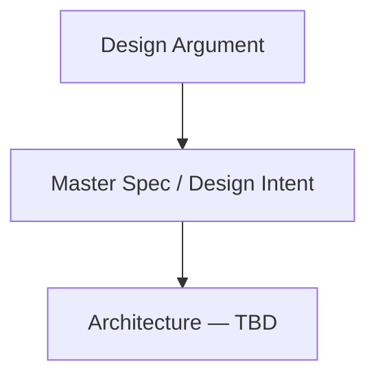

# Persons Required
**SCAD AI 201 — Project 3 (Capstone)**

> A tool built for one real person, one real problem.

**Live URL:** https://tinale21.github.io/PersonsRequired/

**Status:** Pipeline online. Design Argument pending. Build not yet started.

---

## Design Argument

*The pre-AI document: who the Person is, what the Problem is, what "helped" looks like, your Qualification, the Platform Decision, and the Non-Negotiables. Student-authored. Will live at [`claude/design-argument.md`](claude/design-argument.md) once written.*

**TBD.**

---

## Mermaid Diagram

*Architecture diagram of what receives input, how the system processes it, and what it outputs. Will be filled in once the build structure is locked.*



---

## AI Direction Log

*5+ entries minimum for P3, covering the full arc (research synthesis, architecture decisions, platform-specific implementation, iteration based on user feedback). Lives at [`claude/ai-direction-log.md`](claude/ai-direction-log.md).*

**TBD.**

---

## Records of Resistance

*3 documented moments where AI output was rejected or significantly revised, with emphasis on person-level resistance (not just visual). Lives at [`claude/records-of-resistance.md`](claude/records-of-resistance.md). Pre-commit process resistance is also captured in [`claude/checkpoints/`](claude/checkpoints/).*

**TBD.**

---

## First Contact (User Testing Evidence)

*Photos, recordings, quotes, and observations from Session 16 (5/13/26) when the prototype is put in front of the Person. Lives at [`claude/first-contact.md`](claude/first-contact.md).*

**TBD.**

---

## Five Questions Reflection

*Self-audit against the ESF practices: Can I defend this? Is this mine? Did I verify? Would I teach this? Is my disclosure honest? Student-authored, short paragraph.*

**TBD.**

---

## Post-Mortem

*Written reflection on the full Design Cycle for the capstone. Submitted with the case study at Session 20. Lives at [`claude/post-mortem.md`](claude/post-mortem.md).*

**TBD.**

---

## Local Development

```bash
npm install
npm run dev
```

Runs at `http://localhost:5173/PersonsRequired/`

Build for production:

```bash
npm run build
```

Output goes to `dist/`. The deploy workflow (`.github/workflows/deploy.yml`) builds on push to `main` and publishes to GitHub Pages.
