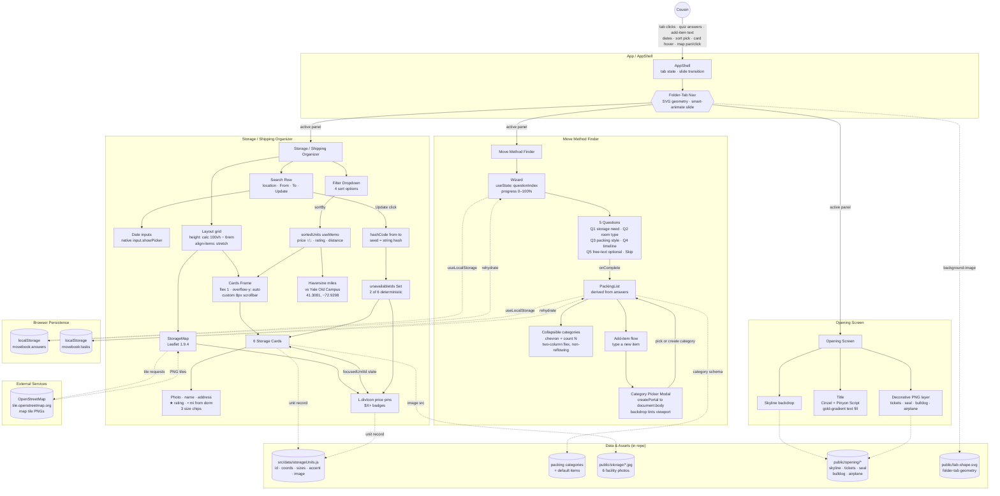

# Persons Required — The Move Book
**SCAD AI 201 — Project 3 (Capstone)**

> A tool built for one real person, one real problem.

---

## Design Argument

My project is aimed at a real person, Hannah, my cousin, who is about to finish high school and go to Yale University in the fall. The issue I found is that relocating from Atlanta to New Haven involves not just one task, but a series of overwhelming choices about what to pack, what she still requires, and how to get ready for a new place. Through discussions and online user testing with Hannah, I discovered that the most beneficial approach was not a general college application, but a specific planning tool that could help her feel more organized before the move.

This research led to the main feature, the Move Method Finder, which utilizes a quiz to create a personalized packing list instead of making her start from the beginning. The option to modify the list, check off items that are packed, and indicate what she still needs was designed to align with how packing actually occurs over time, rather than all at once.

The second key feature, the Storage Unit Finder, was added because moving out of state can lead to uncertainty about what to do with extra items, seasonal belongings, or things that might not fit in a dorm. This feature assists Hannah in exploring storage options near New Haven and comparing prices, making the tool more relevant for her specific move instead of functioning as a generic checklist. My definition of "helped" is that Hannah should be able to navigate the site and leave with a clearer idea of what she needs to pack, what she still has to acquire, and what storage solutions are available if necessary. The visual design also reinforces the idea because the travel-book style presents this transition as a journey from Atlanta to New Haven, making the experience feel more personal and less stressful. Every significant design choice was influenced by Hannah's circumstances, her feedback, and the aim of alleviating the stress of preparing for an out-of-state college move.

---

## Research Documentation

*Evidence gathered about the Person, the Problem, and the surrounding context — interviews, observations, references, alternatives surveyed. Student-authored.*

**TBD.**

---

## Platform Rationale

I chose to build this project as a desktop-focused website because the experience needs enough space to support planning, comparing, and organizing information clearly. Since Hannah Le is preparing for a major out-of-state move, the site needs to handle more complex features. A desktop layout makes sense because she would most likely use this while sitting down to seriously plan her move, compare options, and talk through decisions with family. The storage finder especially benefits from a larger screen because it includes search fields, date filters, storage unit cards, pricing, and a map view all in one place. If this were designed only as a mobile app, those features could feel cramped and harder to compare side by side. A website also makes the tool easier to access without requiring Hannah to download anything during an already busy transition. The platform choice supports the problem because the goal is not quick daily use, but focused planning for a specific life event. This is why a desktop web experience is the right format for helping her organize packing decisions and storage options in one clear place.

---

## AI Direction Log

*Decisions where AI was directed, with what was asked for, what came back, and what was kept or changed. Covers the full arc from pipeline setup to last-mile polish.*

| # | Date | Prompt | AI Output | Decision | Notes |
|---|------|--------|-----------|----------|-------|
| 1 | 2026-05-13 | "Hosting a Vite app in this folder, GitHub Pages via Actions. Do not build anything until I give you documentation." | Asked for assignment docs first, saved them to `claude/docs/`. Then set up Vite 5.4 + React 18.3 (JS, not TS — matches P1/P2), `vite.config.js` with `base: '/PersonsRequired/'`, and a GitHub Actions workflow that deploys to Pages on push to `main`. | **Kept** | Foundation for everything that followed. |
| 2 | 2026-05-13 | "Build out in high-fi and with animation" + 21 Figma screenshots across three surfaces. | Scaffolded all three surfaces in one pass — `AppShell` with tab nav, three panel components, design tokens, base CSS, Cinzel + Pinyon Script + Cormorant Garamond + Inter type system, navy/gold/cream palette. | **Kept (structure) / Revised (contents)** | ~40 pixel-level iterations followed — image positions, scale, font sizes, spacing. |
| 3 | 2026-05-13 | "You forgot the quiz entirely. It should be that they take the quiz and then it generates the 'personalized' recommended list." | Rebuilt MMF as a 5-step `Wizard` (storage need → room type → packing style → timeline → optional free-text) with progress bar, single-select toggle, back-clears-Q1, Skip on Q5. Quiz output drives the packing list contents. | **Revised** | Without the quiz the list is generic — same as the cousin's Notes app. Quiz is what makes it hers. |
| 4 | 2026-05-13 | "It feels a bit overwhelming looking at all the items. Make it a drop down. Display the number of items in each category in parentheses." | Wrapped categories in `
`-style collapsibles with chevron + `(N)` count. First used CSS `columns: 2` — caused right column to reflow when left expanded. Replaced with two independent flex columns (even-index left, odd-index right). | **Revised** | Two iterations: first the dropdown, then the non-reflowing column fix. |
| 5 | 2026-05-13 | "When you add an item and the pop up shows up, it should be just the pop up that shows with the background tinted." | First rendered inline `position: fixed` — backdrop didn't reach viewport edges because `.shell__panel` ancestor had a `transform` (creates a containing block for fixed-positioned descendants). Re-rendered via `createPortal(..., document.body)`. | **Revised** | Platform-specific React/CSS gotcha worth documenting. |
| 6 | 2026-05-13 | Folder-tab shape feedback over many rounds ("the bottom is cut off bruh", "still not quite"). | First tried CSS `clip-path: polygon(...)`; polygons can't represent concave-with-tails without faceting. Switched to SVG (`public/tab-shape.svg`) as `background-image` with `preserveAspectRatio="none"` and cropped `viewBox`. Fixed inverted arc sweep-flag (`0` → `1`) so top corners convex. | **Revised** | High iteration cost, but final result is one SVG file driving every tab state. |
| 7 | 2026-05-13 | "The map is too small and not built out fully so it just looks like the user is moving a picture." | Replaced CSS-art map wholesale with Leaflet 1.9.4 + OpenStreetMap tiles (no API key, no signup). | **Kept** | Bundle 170 → 320 KB. First and only new npm dep since project setup. Real geography for someone moving to an unfamiliar city. |
| 8 | 2026-05-13 | "Can we add pictures to the storage units to replace the placeholders." Person provided 6 PNGs mapped per facility. | Compressed PNG → JPEG via `sips` (q82, max 1200px), placed in `public/storage/<unit-id>.jpg`. Added `image` field to each unit using `${import.meta.env.BASE_URL}storage/<id>.jpg` (required for the GitHub Pages subpath). Replaced inline warehouse SVG with `` over accent-color fallback. | **Kept** | ~1.3 MB total assets; bundle unchanged. |
| 9 | 2026-05-13 | "Frame the left side storage option to match the height of the map, making users scroll to see all." | First attempt: sticky `max-height` cap on the results column. Rejected as "squished." Re-implemented by moving the height constraint up to `.storage__layout` itself: `height: calc(100vh - 6rem)` with `align-items: stretch`. Cards live in a `.storage__cards-frame` with `flex: 1; overflow-y: auto`. Then stripped the visible border on request; kept `padding-right: 0.75rem` so cards don't sit flush against the scrollbar. | **Revised** | Mobile fallback (≤980px) reverts to natural flow — no nested scroll. |
| 10 | 2026-05-13 | "When users add dates for From and To, have it so when they click Update it shuffles the availability of storage units." | Added `appliedDates` state. Hash of `from\|to` ranks the 6 units; bottom 2 marked `_unavailable` — grayscale photo, "Not available" badge, faded body, `aria-disabled`, `tabIndex=-1`. Pins fade. `key={from-to}` on the `<ul>` triggers a 380ms fade-up animation. | **Kept** | Same dates always yield the same 2 unavailable. Dropped "X available for [dates]" copy at user request — shuffle + badges already communicate it. |

---

## Records of Resistance

*Every product-level moment where AI output was rejected, significantly revised, or where AI deliberately declined a default. Grouped by checkpoint in chronological order. Pipeline-setup and README-related checkpoints are excluded because they speak to project plumbing or documentation, not the prototype itself. Detailed context for every entry lives in [`claude/checkpoints/`](claude/checkpoints/).*

### CP03 — Move Book Build

**R1 — Quiz logic over decorative quiz**
- **What AI Produced:** A Move Method Finder with a quiz UI that visually looked complete: four questions, choices laid out as cards, a friendly "generate my list" CTA at the end. The answers were ignored. Every user — regardless of whether they answered "on-campus" or "off-campus," "single room" or "shared," "packing light" or "fully prepared" — received the exact same 60-item canned packing list.
- **Why It Was Rejected:** That makes the "Move Method Finder" name meaningless — it's a survey followed by a generic list, not a recommender. More importantly, a 60-item generic list is exactly what causes the abandonment the success criterion measures against ("she finishes a packing decision list without abandoning it halfway"). A list with bedding suggestions for someone moving into a furnished dorm, or kitchen tools for someone on a meal plan, will get put down halfway through.
- **What Was Done Instead:** Wired the answers into `listGenerator.js` so they genuinely reshape the output: already-owned categories drop out, on/off-campus swaps the dorm vs. apartment section, sharing-room toggles solo-room extras, packing-light trims every section to ~60% of its size, fully-prepared adds extras. The mapping lives in one file Tina can edit after talking to her cousin again.

**R2 — CSS-art map over a real interactive map**
- **What AI Produced:** Considered integrating Leaflet + OpenStreetMap (or a Google Maps API key) to match the Figma's real-map reference for the Storage / Shipping Organizer.
- **Why It Was Rejected:** Premature work for a first pass. The cousin hadn't even looked at storage units yet, so the storage tab was closer to a concept piece than a tool she'd use Wednesday. Integrating a tile service adds a dependency, build complexity, and a maintenance surface for something whose final shape was still uncertain.
- **What Was Done Instead:** Built a CSS-art map with gradients for land/water, SVG roads, and absolutely-positioned price pins as a placeholder direction. Documented in the case study as "design direction" rather than functional feature. Later replaced wholesale with Leaflet + OSM in CP11 once the tab matured and Tina explicitly asked for real geography.

**R3 — Figma frames as backgrounds, not redrawn in code**
- **What AI Produced:** Default instinct was to render the opening-screen title text in CSS using Cinzel font, recreate the tickets/seal/bulldog/airplane as SVGs, and animate each element individually via React state.
- **Why It Was Rejected:** The fidelity gap between hand-coded vector recreations and the actual Figma exports (textured gold foil, vintage paper, hand-drawn skyline shading) is large. The time cost of recreating each element well — and still landing visibly worse than the original — wasn't worth the bundle savings.
- **What Was Done Instead:** Layered 8 flat Figma frames as crossfade-stacked images, preserving every brushstroke. Trade-off: 1.5 MB of static images instead of ~50 KB of SVG. Acceptable for a school project with no traffic; flagged for revisit if this ever went to production.

**R4 — Frame 09's baked-in Start button replaced with JSX button**
- **What AI Produced:** Frame 09 of the Figma export had a Start button rendered into the JPEG, which could have been used directly for pixel-exact visual fidelity to the design.
- **Why It Was Rejected:** A baked PNG button can't have hover, focus, or active states; can't expose itself as a focusable element to screen readers; can't visibly indicate a click target. The opening screen's most important interaction would have been a flat image.
- **What Was Done Instead:** Used only frames 01–08 as background crossfades and rendered an interactive JSX button on top with proper hover/focus/active states and a real click target. Frame 09 preserved in `claude/figma-screens/` for reference.

**R5 — `prefers-reduced-motion` respected**
- **What AI Produced:** Default animation pass would have shipped the opening animation unconditionally — the skyline fade-in, the title slide-up, the staggered decoration entrances would all play regardless of OS settings.
- **Why It Was Rejected:** Users with the OS reduced-motion preference enabled — including possibly the cousin (vestibular sensitivity is common) and certainly some graders — would experience either discomfort or just wasted motion.
- **What Was Done Instead:** Added a `@media (prefers-reduced-motion: reduce)` block that snaps the opening to its final state immediately: Start button visible, decorations in place, no transitions or keyframes firing. Costs ~10 lines of CSS; serves anyone who needs it.

### CP04 — Opening Screen Rebuild

**R1 — Tina's individual assets vs. AI-redrawn SVGs**
- **What AI Produced:** Offered to redraw the tickets, seal, bulldog, and airplane as SVG for a smaller bundle and infinite scalability.
- **Why It Was Rejected:** The originals have textured gold foil, vintage paper, hand-drawn shading — visual qualities that take hours to approximate in vector and would still land visibly worse than the source PNGs.
- **What Was Done Instead:** Used Tina's individual transparent PNG assets as separately positioned image layers. Total payload: ~2.5 MB of images. Each element renders at native resolution and animates independently with CSS transforms.

**R2 — Title in CSS, not baked PNG**
- **What AI Produced:** Offered Tina the option to export the title as a transparent PNG for exact Figma fidelity (matching the gold-foil texture pixel-for-pixel).
- **Why It Was Rejected:** Without her explicit request, a baked PNG locks the type, color, and proportions in. It can't scale crisply across different device pixel ratios, can't be selected or copied, and can't be adjusted without exporting a new file.
- **What Was Done Instead:** Rendered the title in CSS using Cinzel (MOVE/BOOK) with a four-stop gold gradient text fill, Pinyon Script ("The"), and Cormorant Garamond (route). Sharp at any size; the gradient won't perfectly match the Figma's foil texture, but the trade-off is sharpness over fidelity. If she ever wants pixel-exact fidelity, swapping in a PNG is one line.

**R3 — 1440px max-width wrapper anchors the composition**
- **What AI Produced:** Default approach for "responsive" decorative element placement was viewport-percentage positioning everywhere (`top: 17%; left: 7%`, etc.).
- **Why It Was Rejected:** On wide monitors (1920px+), elements fled to the screen corners and lost their relationship to the title. A ticket positioned at `left: 7%` on a 1440px Figma sits where it should; on a 2560px monitor, it shoots 320px further left and dis-anchors from the rest of the composition.
- **What Was Done Instead:** Anchored elements to a Figma-proportional 1440px max-width stage that centers in the viewport. The composition holds together at any wide-monitor width; only the surrounding navy void grows.

**R4 — Pinyon Script chosen over Allura, Great Vibes, Italianno**
- **What AI Produced:** Considered four cursive options for the "The" word above the title: Allura (fuller), Great Vibes (more flourish), Italianno (more brush-like), Pinyon Script (thin copperplate).
- **Why It Was Rejected:** The fuller-stroke options each had more visual weight than the Figma's elegant fine-line script — they would have read as a different mood altogether.
- **What Was Done Instead:** Picked Pinyon Script for its thin copperplate stroke. Renders visually smaller than the alternatives at the same px size, so font-size was bumped from `clamp(1.4rem, 2.6vw, 2.3rem)` to `clamp(1.9rem, 3.4vw, 3rem)` to compensate. Choice noted in case Tina wants to revisit.

**R5 — Did not shrink "The" proportionally with MOVE/BOOK rescales**
- **What AI Produced:** Could have inferred from Tina's repeated MOVE/BOOK rescales (0.85× → 0.8× → 0.82× → 0.85× → 0.82×) that "The" should track proportionally — automating that link as a "smart default."
- **Why It Was Rejected:** She never explicitly requested it. Inferring proportional scaling would have meant overriding decisions she might have deliberately made (e.g., wanting "The" larger relative to MOVE for emphasis, or smaller for hierarchy).
- **What Was Done Instead:** Left "The" alone across every rescale. The final title proportions are her explicit choice, not an inferred one. If she wants proportional scaling later, it's one line of CSS.

**R6 — Bulldog watermark via opacity, not blend-mode**
- **What AI Produced:** Earlier attempt used `mix-blend-mode: screen` on the bulldog asset, blending its white linework into the dark navy veil for a more "integrated" feel.
- **Why It Was Rejected:** Blend-mode screen washed the bulldog out completely — it read as a faint ghost instead of a soft watermark.
- **What Was Done Instead:** Switched to plain `opacity: 0.5` (later tuned to 0.85). Tina then rescaled the asset 1.3× → 1.6× → 1.3× → 1.4× → 1.45×, ending at 1.45× — larger than the Figma reference suggested. Defensible as an editorial choice to make the watermark more visible.

### CP05 — Tabs List and Polish

**R1 — CSS columns over JavaScript masonry library**
- **What AI Produced:** Considered reaching for a JS masonry library (`react-masonry-css`, `masonic`) to handle the packing list's uneven category row heights — the kind of problem people commonly use these libraries for.
- **Why It Was Rejected:** Adding an npm dependency for a 6-line CSS swap is the wrong shape of solution. Extra bundle weight, more surface area for bugs, harder for Tina to reason about, and a maintenance burden if the library goes stale.
- **What Was Done Instead:** Used `columns: 2` + `break-inside: avoid`. Reflows to `columns: 1` on narrow screens naturally with no additional code. (Later reverted in CP08 when collapsibility was added, because CSS columns reflow on height change.)

**R2 — Flat tint over sophisticated layered gradients**
- **What AI Produced:** The opening screen had a sophisticated layered veil over the skyline — a radial vignette plus a linear darken — that looked nicely cinematic.
- **Why It Was Rejected:** Tina preferred a uniform feel. The layered version added complexity that read as a photographer's filter rather than a deliberate atmospheric overlay — more "interesting" but less "honest" to what the screen needs to communicate.
- **What Was Done Instead:** Replaced with a flat `rgba(30, 44, 60, 0.9)` tint. Simpler, more predictable, easier to tune. The radial gradient was more sophisticated; the flat version was more aligned with what the screen needed.

**R3 — Did not invert the bulldog asset**
- **What AI Produced:** Offered to apply CSS `filter: invert(1) sepia(0.3)` to flip the bulldog's colors — currently pale linework on transparent, which would invert to darker linework matching the Figma reference's apparent visual treatment.
- **Why It Was Rejected:** Tina didn't ask. Modifying assets she's happy with risks introducing change she didn't want — the bulldog at `opacity: 0.85` already reads as a faint white watermark, which works on the navy background.
- **What Was Done Instead:** Held back. The bulldog stays at `opacity: 0.85` with no filter manipulation. If she wants the inverted look later, it's one line of CSS.

**R4 — Diagnosis, not rewrite, when "you forgot the quiz entirely"**
- **What AI Produced:** Initial instinct when Tina said "you forgot the quiz entirely" was to rewrite the Wizard component or change the persistence model — assuming the quiz was structurally broken.
- **Why It Was Rejected:** Misdiagnosis. The quiz existed at `Wizard.jsx` and worked correctly. The issue was stale localStorage (`movebook:answers` + `movebook:tasks` from earlier testing) routing past the wizard via the `hasList` conditional that checks for prior answers.
- **What Was Done Instead:** Diagnosed the persistence cache and surfaced "clear localStorage" or "click Redo the Move Method Finder" as the resolution. No code change — the existing flow was correct. Lesson: when something "isn't working," check the runtime state before assuming code is broken.

### CP06 — Folder Tabs / Quiz Slide

**R1 — Polygon clip-path abandoned for SVG background**
- **What AI Produced:** Spent the better part of a session iterating on `clip-path: polygon()` to produce a folder-tab shape with concave fillets at the bottom and a tail protrusion below. Tried vertex chamfers, multiple polygon paths, fake arcs via many polygon vertices.
- **Why It Was Rejected:** Every approach hit a wall. Chamfers looked outward-bevelled, concave arcs were faceted, tails-with-main-bottom-inset created a gap in the middle of the bottom edge. Polygon fundamentally can't represent concave curves cleanly.
- **What Was Done Instead:** Switched to a Figma-exported SVG used as `background-image` with `preserveAspectRatio="none"` and a cropped viewBox. The SVG has real bezier curves and arcs, plus separate tail paths — none of which polygon can do. The session of iteration was a wasted-effort cost to learn what polygon couldn't do; the final solution is one SVG file.

**R2 — Explicit `A` arcs over original cubic Beziers**
- **What AI Produced:** The original SVG had top corners formed by tiny cubic Bezier curves (~1px radius) — the Figma export's default.
- **Why It Was Rejected:** For "round more," cubic Beziers don't expose a clean radius parameter. Tuning the corner radius required adjusting four control points per corner — fiddly and error-prone. First arc attempt used SVG sweep-flag `0` and the corners read as concave (curving inward, like an inset).
- **What Was Done Instead:** Rewrote the top corners as `A 10 10 0 0 1 ...` arc commands with sweep-flag `1` for the correct convex outward curve. Lesson logged: SVG arc sweep flags determine which side of the chord the arc bulges to. Sweep `1` curves clockwise (visually), which for a CW polygon traversal at a convex corner is "outward."

**R3 — `notes` field captured but not list-shaping**
- **What AI Produced:** Could have wired the 5th-question free-text answer (`answers.notes`) into `listGenerator.js` to do keyword-based shaping — e.g., "winter" → boost winter clothes, "international" → add power adapter, "athlete" → add sports gear.
- **Why It Was Rejected:** Keyword detection is its own design problem. What dictionary? Case-sensitive? Phrase matching? Synonym handling? Negation ("not interested in sports")? It's not in scope for this checkpoint.
- **What Was Done Instead:** Captured the notes to localStorage and the cousin's eventual review. The 5th question is currently context/feedback rather than a list-shaping input. Future work flagged in the case study.

**R4 — Did not build the body-bump approach for tab-to-body merging**
- **What AI Produced:** Tina's reference image showed the body's top edge having convex bumps where the tab meets it (the manila-folder visual where the tab's tail curls into the body). Building this would require either (a) the body knowing the active tab's position via JS measurement (DOM measurement + resize listener + state sync) or (b) restructuring tabs and body into one continuous SVG element.
- **Why It Was Rejected:** Both options add significant runtime complexity for what's fundamentally a small visual effect. JS measurement adds layout thrash and a useEffect dependency on window resize; restructuring tabs+body would require rebuilding the smart-animate panel transition from scratch.
- **What Was Done Instead:** Used the SVG's tail extensions to imply tab-to-body merging within the tab's own bounds. The tails extend past the tab's natural footprint and create the curl visual where they overlap the body's top edge. Close enough to the manila reference for a school project; much simpler than body-position-aware bumps.

**R5 — Accepted unequal panel heights**
- **What AI Produced:** With CSS grid stacking, the two panels share a grid cell whose height is `max(method_panel, storage_panel)`. The shorter panel (usually the wizard) has visible empty space below it when active. The alternative — JS-driven container height that tracks the active panel via ResizeObserver — would give exact panel-fit heights.
- **Why It Was Rejected:** ResizeObserver plus state-synced container height adds DOM measurement and a reactive sync surface for a minor visual asymmetry. The empty space below the wizard isn't visually broken; it's just unused.
- **What Was Done Instead:** Accepted the empty space as a known limitation. Noted in the commit message; revisitable if the height gap ever becomes glaring on a specific screen size.

### CP07 — Wizard Polish

**R1 — Gold gradient Next button reverted to black**
- **What AI Produced:** At one point colored the Next button with the same gold gradient used in the opening screen's Start CTA, for visual continuity across surfaces.
- **Why It Was Rejected:** Tina said it was too prominent against the otherwise muted wizard UI — the gold pulled attention away from the user's *choices*, which should be the visual center.
- **What Was Done Instead:** Reverted to a black button. Principle logged: the opening screen is theatrical (gold gradient, decorative elements, atmospheric tint); the wizard should fade into the background so the user's answer choices stand out. Two different visual languages for two different jobs.

**R2 — `.wizard__actions` scale didn't apply due to keyframe override**
- **What AI Produced:** First attempt at scaling `.wizard__actions` (0.7×, 0.85×, 0.9×, 0.5×) appeared not to take effect — Tina kept saying "it still looks the same size."
- **Why It Was Rejected:** Diagnosis: the `actionsIn` keyframe ended with `transform: translateY(0)`, which overrode the static `transform: scale()` on the same element. CSS animations win on any property they touch during their run; once `actionsIn` completes with `transform: translateY(0)`, the scale is lost.
- **What Was Done Instead:** Bundled `scale()` inside the keyframe transforms so they compose correctly (`transform: translateY(0) scale(0.85)` at the end of the keyframe). Lesson logged: when both static and keyframe `transform` are set on the same element, the keyframe wins. Use a CSS variable, scope the scale to a child, or bundle into the keyframe.

**R3 — Back-button-on-left attempt left it invisible**
- **What AI Produced:** First attempt at right-aligning the Back button used `align-self: flex-end; margin-top: -2.5rem` to lift it visually above the actions row.
- **Why It Was Rejected:** The negative margin lifted Back above the choices area entirely — out of the visible flow. Tina said "now the Back button isn't even there." Tried absolute positioning anchored to the actions row next, which worked but felt cramped.
- **What Was Done Instead:** Iterated through grid 1fr-auto-1fr placement, then finally relocated Back entirely — turned it into a chevron icon beside the progress bar at the top of the wizard. This solved the problem by moving Back out of the actions area altogether, rather than fighting to make it fit.

**R4 — Single-select toggle behavior**
- **What AI Produced:** Default single-select behavior required committing to a choice once clicked — no way to "unpick" without picking a different option.
- **Why It Was Rejected:** Tina explicitly asked for the deselect-on-re-click behavior. It lets a user start an answer, change their mind, and step away from the question — and pairs with the Q1-Back-resets-selection change so the cousin's choices feel undoable rather than committed.
- **What Was Done Instead:** Added toggle behavior: clicking an already-selected single-select option deselects it. Visual treatment matches multi-select; both feel like the same affordance now.

### CP08 — Collapsible Packing List

**R1 — Default state collapsed, not expanded**
- **What AI Produced:** Natural-feeling default for a freshly-generated list might be "expand everything" so the user sees the quiz result immediately — all categories visible, all items reviewable in one scroll.
- **Why It Was Rejected:** Tina explicitly said the list "feels overwhelming." Showing everything by default is the worst case for the success criterion ("finishes without abandoning halfway") — the cousin opens the list, sees 60 items, closes it.
- **What Was Done Instead:** Collapsed-by-default. The list opens showing just category headers with `(N)` counts; the user opts in to seeing items per category. Trade-off: a slight increase in clicks-to-reveal — acceptable for the cousin's audience, who would otherwise bounce off a wall of items.

**R2 — Item count reflects current filter, not category total**
- **What AI Produced:** Considered showing the category total always — `Clothes (10)` would always show 10, regardless of the Active/Completed filter above the list.
- **Why It Was Rejected:** Inconsistent with the filter affordance. When the filter is Active, the user is intentionally looking at remaining work — and a count of 10 (which includes already-checked items) would be misleading. The eye reads `(N)` as "how many things in this view," not "how many things total."
- **What Was Done Instead:** Count uses `group.items.length` post-filter. `Clothes (4)` always means "4 things visible in this category right now." If both numbers are wanted later (`Clothes (4 / 10)`), it's a small change.

**R3 — Grid `align-items: start` over CSS columns**
- **What AI Produced:** Checkpoint 05's fix used CSS `columns: 2` specifically to solve the empty-band-below-short-categories problem. Carrying that forward into the collapsible version was the obvious continuity.
- **Why It Was Rejected:** CSS columns reflow on height change. The just-added collapsibility means every expand/collapse triggers a column reshuffle — categories jump from the left column to the right and back as content height changes.
- **What Was Done Instead:** Reverted to grid layout with `align-items: start` so cells anchor to the top of their row. Trade-off: when a short cell sits next to a tall (expanded) cell in the same row, the short one doesn't stretch to fill — leaving empty space below it. Much more contained than CSS columns' full-page reshuffling on every interaction.

### CP09 — Category Picker Modal

**R1 — Portal mandatory due to transform stacking context**
- **What AI Produced:** First attempt at the category-picker modal used `position: fixed; z-index: 100` directly inside the PackingList component — the standard React modal pattern.
- **Why It Was Rejected:** The backdrop appeared to "float" over the packing list but did NOT cover the dark header or the top of the page. Diagnosis: `.shell__panel` (an ancestor) has `transform: translateX(±100%)` for the smart-animate slide. Per CSS containing-block rules, any ancestor with a `transform`, `filter`, `perspective`, or `will-change` turns `position: fixed` into "fixed relative to that ancestor" — not the viewport.
- **What Was Done Instead:** Rendered the modal via `createPortal(..., document.body)` so no ancestor has a transform. Modal now reaches the actual viewport edges. Lesson logged: any time `position: fixed` doesn't reach the viewport, the cause is almost always an ancestor with one of those four CSS properties.

**R2 — Two flex columns over grid for true row-independence**
- **What AI Produced:** First attempt at the two-column packing list used CSS Grid `repeat(2, 1fr)` with `align-items: start`, expecting cells to align top-of-row but stay independent.
- **Why It Was Rejected:** `align-items: start` controls alignment within a row, but the row height is still the max of the cells in it. Expanding a category in the left column raised the row height; the right column's cells then shifted down because the row was taller. Not truly independent.
- **What Was Done Instead:** Restructured as `.plist__grid` > two `.plist__col` (each its own flex container) > `.plist__group`*. The outer grid only lays out the two columns side-by-side; vertical content within each column is independent. Trade-off: lost the even row-by-row reading order — categories now go down the left column entirely, then down the right column. Acceptable for a 4–6 category list.

**R3 — Modal forces category up front, doesn't pre-fill**
- **What AI Produced:** Considered creating new items immediately in an "Other" category and letting the user recategorize later — one fewer click for the common case where the user just wants to add an item quickly.
- **Why It Was Rejected:** Defers the categorization decision and would clutter "Other" with mis-categorized items if the user forgets to fix them. The design goal is "the list feels organized," and a growing "Other" pile is the opposite.
- **What Was Done Instead:** The modal shows the typed item in quotes (`"Tea kettle"`) but creation only happens when the user picks a category (or creates a new one). If they cancel, the input retains its value so they can edit and try again. Forces the categorization decision up front.

**R4 — Stronger backdrop than initial taste**
- **What AI Produced:** Started the backdrop at `rgba(13, 20, 36, 0.45)` — a soft modern dim that feels subtle and contemporary.
- **Why It Was Rejected:** Tina asked for "just the popup, background tinted" — meaning unambiguous focus on the modal, not a subtle veil. The 0.45 opacity still let the packing list compete for attention.
- **What Was Done Instead:** Bumped to `rgba(13, 20, 36, 0.6) + backdrop-filter: blur(4px)`. Reads closer to a system-dialog feel than a stylized overlay; matches the "modal as a focused decision moment" the user wanted.

### CP10 — Header Tint

**R1 — Adjusted overlay only, not the source image**
- **What AI Produced:** The instinct when "more tint" is asked is to consider darkening the skyline JPG itself or replacing it with a darker variant.
- **Why It Was Rejected:** The skyline image is used in two places (opening screen background + AppShell header) and is part of the unified asset palette. Modifying the source asset would de-sync the two surfaces or require maintaining two versions of the same image.
- **What Was Done Instead:** Adjusted only the gradient overlay on the header. The skyline image stays as a single shared asset; the per-surface treatment (more tint on the header, less on the opening) lives entirely in CSS.

**R2 — Bottom stop at full opacity**
- **What AI Produced:** Considered a symmetric semi-transparent gradient (top 0.82, bottom 0.82) for a uniformly tinted strip across the header.
- **Why It Was Rejected:** A partially-transparent bottom let a sliver of the original skyline peek through where the header meets the cream body — a visible "ghost skyline" that broke the clean tab-to-body seam, especially noticeable on the active tab's bottom edge.
- **What Was Done Instead:** Top stop at 0.82 (preserves an atmospheric glow at the very top of the header); bottom stop at 1.0 (fully opaque, so the tab's bottom meets a solid clean navy color, no transparency artifacts).

### CP11 — Leaflet Map

**R1 — Accepted Leaflet's bundle cost for real geography**
- **What AI Produced:** Considered keeping the CSS-art map from CP03 to avoid the bundle hit, or switching to Mapbox / Google Maps (which require API keys + billing).
- **Why It Was Rejected:** The CSS-art map "just looks like the user is moving a picture" — drag-panning revealed no actual geography. The cousin is moving from Atlanta to a city she's never visited; a real map of where storage facilities actually sit is materially more useful than any abstraction. Mapbox/Google Maps add account setup and billing surface.
- **What Was Done Instead:** Integrated Leaflet + OpenStreetMap tiles (free, no API key, no signup). Bundle grew 170 KB → 320 KB (~140 KB for Leaflet itself). Documented code-splitting Leaflet behind a dynamic import as future optimization — would load only when the Storage tab opens, cutting the first-load cost for users who never visit the storage section.

**R2 — Raw Leaflet over `react-leaflet`**
- **What AI Produced:** `react-leaflet` exists and provides declarative React wrappers (`<MapContainer>`, `<TileLayer>`, `<Marker>`) for a more idiomatic-feeling React integration.
- **Why It Was Rejected:** Adds a second dependency for a thin wrapper around an imperative API that's only ~50 lines once you write it directly. The wrapper's idioms become a thing future maintainers have to learn on top of Leaflet's own API.
- **What Was Done Instead:** Used raw Leaflet with `useEffect` + `useRef` directly in `StorageMap.jsx`. Self-contained component; anyone reading it can use Leaflet's documentation directly without an intermediate translation layer.

**R3 — Approximate coordinates, not geocoded at runtime**
- **What AI Produced:** Could have called a geocoding service (Nominatim, Mapbox, Google) to convert each facility's street address into precise lat/lng at render time — accurate coordinates without manual entry.
- **Why It Was Rejected:** Network call at render adds latency. A geocoding service needs rate-limit handling, possibly signup or billing, and a fallback path for when the service fails. For a demo where neighborhood-level accuracy is sufficient, that complexity isn't worth it.
- **What Was Done Instead:** Hand-picked lat/lng based on each facility's neighborhood from its address (e.g., "400 Derby Avenue, West Haven" → ~`[41.272, -72.967]`). "Close to the right block" is sufficient for the cousin's purposes. Documented in checkpoint 11 R3 as approximate.

**R4 — Rebuild markers, don't diff**
- **What AI Produced:** Could have implemented a "diff existing markers, update only changes" pattern for the marker-sync `useEffect` — track marker IDs, identify added/removed/changed, update only the deltas.
- **Why It Was Rejected:** Premature optimization for six markers. Diffing adds code complexity that obscures the simple logic of "show what's in the data."
- **What Was Done Instead:** Clear-and-rebuild all markers on every state change. Correct, simple, fast enough. If the unit count ever grows past ~50, switch to diffing — but the threshold for that isn't six.

### CP12 — Storage Photos

**R1 — `BASE_URL` prefix mandatory for JS-driven asset paths**
- **What AI Produced:** First instinct was bare paths: `image: '/storage/safeguard.jpg'`.
- **Why It Was Rejected:** Works in `npm run dev` (Vite serves from root `/`), 404s on GitHub Pages where the site is hosted at `/PersonsRequired/`. The image resolves to `tinale21.github.io/storage/safeguard.jpg` → 404. Vite auto-rewrites paths in CSS (`url(...)` → correct base), but doesn't rewrite data-driven URLs declared in JS modules.
- **What Was Done Instead:** Used `${import.meta.env.BASE_URL}storage/<id>.jpg`. Vite substitutes the configured `base` value (`/PersonsRequired/`) at build time in production and `/` in dev. Same data file works in both environments without manual switching.

**R2 — `` over CSS `background-image`**
- **What AI Produced:** Could have set photos as CSS `background-image: url(...)` with `background-size: cover` — visually identical for a fixed-size container.
- **Why It Was Rejected:** Loses `loading="lazy"` (no automatic deferral for off-screen cards), no `onError` graceful fallback (broken URLs silently show nothing instead of falling back to the accent color), no semantic value for accessibility tools, harder to feature-flag per unit.
- **What Was Done Instead:** Used `` over the accent-color fallback. Free lazy-loading, automatic fallback to the accent block when the photo fails, proper semantics for assistive tech.

**R3 — Dropped the overlay gradient**
- **What AI Produced:** Kept the `.storage-card__image::before` linear gradient overlay (`linear-gradient(135deg, rgba(255,255,255,0.18), rgba(0,0,0,0.2))`) from the placeholder era — originally designed to give depth to the flat-color block under the white warehouse SVG.
- **Why It Was Rejected:** Over real photos, the gradient just washed them out and lowered contrast. The photos already have visual variance — they don't need an artificial depth cue.
- **What Was Done Instead:** Deleted the overlay entirely rather than keeping it at reduced opacity. Photos render directly on the card; no muddying filter on top.

**R4 — Kept the colored accent fallback**
- **What AI Produced:** Could have removed the per-unit `--accent` color entirely now that photos cover it — no longer visually load-bearing.
- **Why It Was Rejected:** If any image fails to load — network error, file rename, CDN issue, `onError` fires — the card would become a blank empty header. The accent color costs nothing when photos load (the `` sits opaque on top) and provides a graceful fallback when they don't.
- **What Was Done Instead:** Kept the accent background underneath every ``. Defense in depth for a free price.

**R5 — JPEG q82, not WebP/AVIF + `<picture>`**
- **What AI Produced:** Could have shipped WebP/AVIF with a `<picture>` element and multiple sizes — a production-grade responsive image pipeline.
- **Why It Was Rejected:** Production-grade asset pipeline for a 130–170 px thumbnail in a school project is overkill. Adds build complexity (image conversion step, multiple files per asset, different formats per browser), and the visual benefit at thumbnail sizes is negligible.
- **What Was Done Instead:** Compressed PNG → JPEG via `sips` at quality 82, max edge 1200px. Sufficient fidelity at the rendered size; ~1.3 MB total across six files. One conversion step, one file per facility.

### CP13 — Storage Card Polish

**R1 — First scrollable-frame attempt rejected as "squished"**
- **What AI Produced:** First implementation put a sticky `max-height: calc(100vh - 6rem)` on `.storage__results` directly, with `.storage__cards` getting `flex: 1; overflow-y: auto` inside.
- **Why It Was Rejected:** The heading + count row above the cards ate too much of the capped height, leaving the cards crammed into a small box. Tina described it as "squished." Also, both columns were independently capped at the same `max-height`, but the map's `aspect-ratio: 4/5` could make it shorter than the cap while results filled the full cap. Heights didn't actually match between the two columns.
- **What Was Done Instead:** Moved the height constraint up to `.storage__layout` itself: `height: calc(100vh - 6rem)` with `align-items: stretch`. Both grid children share the exact same row height because the row's height is now explicit, not derived from content. Heading + count stay above the cards-frame, which absorbs the remaining height and scrolls.

**R2 — Stripped the framed look entirely**
- **What AI Produced:** Initial scrollable-frame implementation had the cards-frame styled as a visible container — `1px solid var(--color-border)`, `border-radius: 14px`, `padding: 0.85rem`, `background: var(--color-cream-panel)`. Read as "this is a contained scroll region."
- **Why It Was Rejected:** Tina wanted only the scroll behavior, not the visual chrome. The bordered container competed with the cards for attention and made the page feel more chrome-heavy than designed.
- **What Was Done Instead:** Stripped border, background, and most of the padding. Kept `padding-right: 0.75rem` so the right column's cards don't sit flush against the custom 8px scrollbar. The frame's job is now purely functional (scroll containment); the visual treatment is gone.

**R3 — Design token over one-off hex**
- **What AI Produced:** Cycled through three colors for the `•` bullet separator between rating and distance: `--color-ink-soft` (`#4a5468`, matched the address — too prominent), then a hand-picked `#9a9a9a`, then back to a token request.
- **Why It Was Rejected:** The hand-picked hex adds a one-off color outside the palette token system. Future palette shifts won't propagate to it; the bullet might drift visually from the rest of the muted-text family.
- **What Was Done Instead:** Switched to `var(--color-muted)` (`#94a0b3`) — already a defined token for secondary text. Stays in the system; bullet color remains consistent if the palette shifts.

**R4 — Kept `aspect-ratio: 4/5` rule despite desktop override**
- **What AI Produced:** Considered removing the map's `aspect-ratio: 4/5` rule entirely since grid `align-items: stretch` overrides it on desktop (the row height is dictated by `calc(100vh - 6rem)`, not the map's aspect ratio).
- **Why It Was Rejected:** The rule is still load-bearing on the mobile single-column layout (≤980px), where `align-items: stretch` doesn't apply because there's no row to stretch within — the columns are stacked vertically. Without `aspect-ratio`, the map would have no intrinsic shape on mobile.
- **What Was Done Instead:** Left the rule in place. It's a silent no-op on desktop (overridden by stretch) and active on mobile. Two lines of CSS that both make sense in their respective contexts; cleaner than a media-query branch.

### CP14 — Date Availability

**R1 — Deterministic hash over `Math.random`**
- **What AI Produced:** First instinct was to pick the 2 unavailable units randomly each Update click via `Math.random()` — cheap to implement, simple to reason about.
- **Why It Was Rejected:** Same dates yielding different results would break the cousin's trust. Pick May 15–22, see Safeguard unavailable; pick May 15–22 again, Safeguard now available — feels like dates don't actually drive the result. The whole point of the feature is to make dates feel load-bearing.
- **What Was Done Instead:** Used a small string hash of `from|to` as the seed for deterministic ranking. Same input always produces the same 2 unavailable units, simulating a real backend lookup. Different dates produce different units. Persists the illusion of "this is a real availability check" even though it's a deterministic function.

**R2 — Constant 2 of 6 unavailable, not variable**
- **What AI Produced:** Considered varying the unavailable count (sometimes 1, sometimes 3) based on a second hash for more apparent realism — "different dates have different supply."
- **Why It Was Rejected:** With only 6 total units, hitting 0 unavailable (everything looks available, no apparent date impact) or 5 unavailable (only one option left, stressful UX) on some date pairs would look glitchy or alarming.
- **What Was Done Instead:** Constant 2 of 6 unavailable on every applied-dates change. Predictable visual rhythm: cousin always sees 4 available options, with 2 grayed out at the bottom. If the unit count grows past ~10, revisit and make it a ratio.

**R3 — Pushed unavailable to bottom, didn't filter out**
- **What AI Produced:** Considered filtering unavailable units out of the displayed list entirely — clean, only-available view.
- **Why It Was Rejected:** The cousin should *see* which facilities aren't available — it's useful info (she might check back later, or it nudges urgency on the ones that are available). Filtering also shrinks the visible card count, which breaks the "Showing 1 – 6 of 80 movers" copy stability and forces conditional rendering.
- **What Was Done Instead:** Pushed unavailable units to the bottom of the sorted list with grayscale photo + dark "Not available" badge + faded body. Total card count stays constant; copy stays valid; the "what's unavailable" information remains visible without being noisy.

**R4 — Key-driven remount over FLIP animation**
- **What AI Produced:** Considered implementing a FLIP (First-Last-Invert-Play) animation via the Web Animations API for a literal "cards physically reshuffle to new positions" effect.
- **Why It Was Rejected:** ~100 lines of plumbing (capture positions before, capture after, animate the deltas, handle interruption mid-animation, clean up) for what visually needs to read as "the list updated."
- **What Was Done Instead:** Used `key={from-to}` on the `<ul>` to force React to fully remount the list when the applied dates change. The remount triggers a single 380ms `cardsShuffle` keyframe fade-up on the new grid. One line of JSX + 8 lines of CSS; reads as "the list updated" without simulating physics.

**R5 — Dropped the "X available" copy at user request**
- **What AI Produced:** First version added a status line under the count: `"4 available for 2026-05-13 – 2026-05-20 · Sorted by …"` when dates were applied.
- **Why It Was Rejected:** Tina said the shuffle, the grayscale, and the badges already communicate the change. The extra text was redundant — saying out loud what the design already says.
- **What Was Done Instead:** Reverted to the original count line ("Showing 1 – 6 of 80 movers · Sorted by …"). Trusted the visual change to do its job; let the design carry the meaning without prose backup.

**R6 — Disabled focus/hover, didn't route to a modal**
- **What AI Produced:** Considered routing a click on an unavailable card to a "this is unavailable for your dates" modal explaining the state and offering alternative dates.
- **Why It Was Rejected:** Over-engineered for a demo. Adds modal complexity (another state, another component, another a11y surface) for a feature whose meaning is already communicated by the badge + grayscale.
- **What Was Done Instead:** Set `tabIndex={-1}`, `aria-disabled`, and gated hover/focus/click handlers on unavailable cards. Keyboard navigation skips them; screen readers announce them as disabled; hover effects suppress. Affordance can be upgraded to a modal later if real users want it.

### CP15 — Scroll Frame Clip Fix

**R1 — Padding over `overflow: visible` or removing the hover lift**
- **What AI Produced:** When top-row cards were clipped on hover (the `translateY(-2px)` lift and the drop shadow extended above the scroll viewport's clip boundary), the two obvious alternatives were `overflow: visible` on the frame (defeats scrolling) or removing the hover lift entirely (breaks visual consistency with cards elsewhere in the app).
- **Why It Was Rejected:** Both alternatives sacrifice a working feature to fix a clipping issue. `overflow: visible` would let cards below the fold render outside the column. Removing the lift would make these cards behave differently from the rest, undermining the app's interaction language.
- **What Was Done Instead:** Added `padding: 8px 0.75rem 8px 0` to `.storage__cards-frame` so the lift has room to render within the scroll viewport. The smallest correct change — keeps scrolling, keeps the lift, just gives it space to breathe.

**R2 — Compensated the spacing shift**
- **What AI Produced:** Adding 8px top padding to the frame would shift the first card row 8px lower than its prior position — a visible regression in the page's vertical rhythm.
- **Why It Was Rejected:** Even though the fix would work, the layout shift would look like an unintentional regression to anyone comparing before/after screenshots. Worse, it would shift the entire results column relative to the map column next to it.
- **What Was Done Instead:** Subtracted 8px from the count line's `margin-bottom`: `1.25rem` → `calc(1.25rem - 8px)`. Net spacing between count and first card row is identical to before; only the clipping boundary moved. Used `calc()` to keep the offset visible in source rather than hiding it as a raw `12px`.

---

## Five Questions Reflection

### Can I defend this?
Yes, I can support this project because every key decision relates back to my cousin, Hannah Le, and the change she is about to face. I decided to create The Move Book because Hannah is graduating from high school and getting ready to go to Yale University in the fall, which means she is relocating from Atlanta to New Haven and stepping into a new level of independence. The choice to emphasize the Move Method Finder came from the realization that one of the most daunting aspects of moving to college is figuring out what to pack, what is truly necessary, and what can be left behind. I also added a storage unit feature because storage is important for an out-of-state move, especially if Hannah needs to look at nearby options, prices, and locations around New Haven. I can clarify the quiz format because it provides Hannah with a structured starting point rather than having her create a packing list from the ground up. I can also justify the travel-book visual style because the project focuses on a personal journey, so the interface should feel transitional, supportive, and connected to the concept of starting a new chapter.

### Is this mine?
This project belongs to me because I made all the decisions regarding the original concept, user, design direction, and functionality. I selected Hannah as my design focus because her journey from high school in Atlanta to college at Yale was personal, specific, and significant. AI assisted me in developing my ideas, improving my writing, and considering how to enhance the flow, but it did not dictate the project's direction. The visual style, which includes the travel-book concept, gold typography, the route from Atlanta to New Haven, and stamp-inspired elements, originated from the creative direction I wanted to pursue. I also determined the functionality choices, such as the quiz-based Move Method Finder and the storage unit discovery feature, as they seemed most beneficial for Hannah's transition. AI served as a supportive tool, but the final project showcases my own thoughts, design decisions, and insights into what would best assist my user.

### Did I verify?
I confirmed the project by ensuring that the flow was logical for someone getting ready to move out of state for college. I looked over the experience from the landing page through the quiz questions to the packing list generated, ensuring each step had a clear purpose. I also verified that the quiz questions related to the suggested items, so Hannah wouldn't feel like she was just answering random questions. Keeping the search for storage units was sensible because it provides her with a practical way to compare local options and prices if she needs storage near New Haven. I made sure that the product remained focused on assisting her with the move rather than turning into a general college planning tool. However, I still believe that the best verification came from Hannah using the prototype herself and sharing what she finds helpful, missing, or unnecessary.

### Would I teach this?
Yes, I would teach this because I clearly understand the purpose, structure, and design choices of the project. I could explain that The Move Book is not just a standard college checklist, but a tailored packing and storage planner for Hannah as she gets ready to move from Atlanta to New Haven. I could guide someone through the reason the experience begins with a quiz, as it reduces the stress of planning by asking straightforward questions and converting the responses into a suggested packing list. I could also clarify how Hannah can modify the list, check off items she has packed, and indicate what she still needs. I see the value in keeping the storage feature in the project because comparing storage units, locations, and prices can help her move in a practical manner. I could teach both the UX reasoning and the visual approach, including how the travel-book style enhances the concept of a personal journey and a new chapter.

### Is my documentation honest?
My documentation is truthful as it shows how the project truly evolved and the decisions I made during the process. I started with an out-of-state college move planner and shaped it around what would be most useful for Hannah. I also performed online user testing with Hannah and recorded her feedback to ensure the project met her actual needs and desires, rather than just my assumptions about what would be useful. Her feedback helped me confirm the direction of the Move Method Finder, the packing suggestions, and the storage unit search feature. My AI Direction Log should demonstrate that I utilized AI to develop feature logic and enhance visual instructions, but I continued to make choices based on Hannah's needs and my own design insights. The documentation is honest because it illustrates both the assistance AI provided and the user-focused decisions I made to adapt the final project to Hannah's genuine transition.

---

## Post-Mortem

*Written reflection on the full Design Cycle for the capstone. Submitted with the case study at Session 20. Student-authored.*

**TBD.**

---

## Mermaid Diagram

What receives input, how the system processes it, and what it outputs. Subgraphs group the three runtime surfaces; the right column shows the data sources, external services, and browser persistence that everything reads from / writes to.

---

## User Testing Evidence

*Photos, recordings, quotes, and observations from Session 16 (5/13/26) when the prototype is put in front of the Person. Student-authored.*

**TBD.**

---

## Live URL

https://tinale21.github.io/PersonsRequired/
