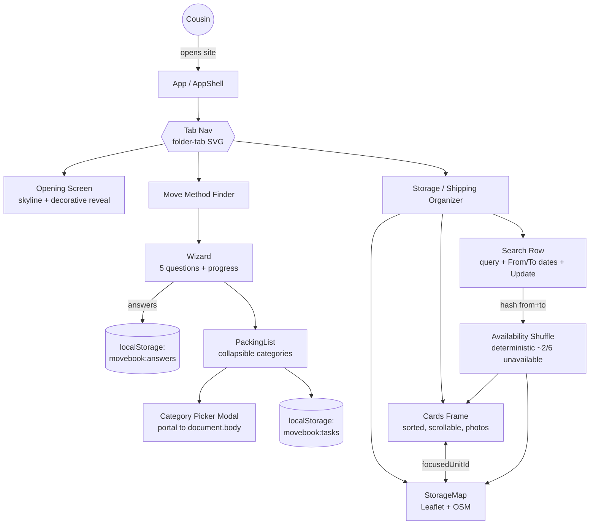

# Persons Required — The Move Book
**SCAD AI 201 — Project 3 (Capstone)**

> A tool built for one real person, one real problem.

**Live URL:** https://tinale21.github.io/PersonsRequired/

**Status:** High-fidelity prototype shipped across all three surfaces (Opening, Move Method Finder, Storage / Shipping Organizer). Design Argument, AI Direction Log, and First Contact (Session 16) student-authored docs still pending.

---

## Design Argument

*The pre-AI document: who the Person is, what the Problem is, what "helped" looks like, your Qualification, the Platform Decision, and the Non-Negotiables. Student-authored. Will live at [`claude/design-argument.md`](claude/design-argument.md) once written.*

**TBD.**

---

## What's Built

The Move Book is a three-surface web app for the cousin (Atlanta → Yale, fall 2026):

### 1. Opening Screen
Animated reveal of the New Haven skyline with the title (Cinzel + Pinyon Script, gold gradient), layered decorative elements (tickets, seal, bulldog, airplane). Sets the tone before the working tools.

### 2. Move Method Finder
A 5-question quiz (storage need, room type, packing style, timeline, optional free-text) → generates a categorized packing list. Quiz features: percentage progress bar, single-select toggle (click to deselect), back navigation that clears Q1's answer, optional 5th question with Skip. Packing list features: collapsible categories with item counts, two-column layout that doesn't reflow when one side expands, add-item flow with a portal-mounted category picker modal (background dim, escape viewport-edge clipping). Answers + task state persist via `localStorage`.

### 3. Storage / Shipping Organizer
Search row (location query, From/To date pickers via native `showPicker()`, Update button). Two-column layout sharing one fixed-height grid row (`calc(100vh - 6rem)`):
- **Left:** scrollable results frame with 6 cards (real facility photos, rating, miles from Yale Old Campus via Haversine, three size chips with prices). Sort filter dropdown (price asc/desc, star rating, distance from dorm). Internal scroll, custom 8px scrollbar.
- **Right:** real interactive Leaflet map of New Haven (drag, scroll-wheel/pinch zoom, OpenStreetMap tiles, custom `divIcon` price-badge pins). Cards ↔ pins sync via shared `focusedUnitId` state.

Clicking **Update** with both dates filled triggers a deterministic availability shuffle: a hash of `from|to` marks 2 of 6 units `_unavailable` (grayscale photo, dark "Not available" badge, faded body, `aria-disabled`, `tabIndex=-1`), pushes them to the bottom of the sorted list, fades the corresponding map pins, and plays a 380ms fade-up animation on the cards grid. Same dates always produce the same result (feels like a real availability check).

---

## Tech Stack

- **Vite 5.4** + **React 18.3** (JavaScript, not TypeScript — matches prior P1/P2)
- **Vanilla CSS** with design tokens (Cinzel, Pinyon Script, Cormorant Garamond, Inter; navy/gold/cream palette)
- **Leaflet 1.9.4** + **OpenStreetMap** tiles (no API key, no signup)
- **localStorage** (`movebook:answers`, `movebook:tasks`) for persistence between sessions
- **GitHub Pages** deploy via `.github/workflows/deploy.yml` on push to `main`

---

## Mermaid Diagram



---

## AI Direction Log

*5+ entries minimum for P3, covering the full arc (research synthesis, architecture decisions, platform-specific implementation, iteration based on user feedback). Lives at [`claude/ai-direction-log.md`](claude/ai-direction-log.md).*

**TBD.**

---

## Records of Resistance

*3 documented moments where AI output was rejected or significantly revised, with emphasis on person-level resistance (not just visual). Lives at [`claude/records-of-resistance.md`](claude/records-of-resistance.md). Pre-commit process resistance is also captured in [`claude/checkpoints/`](claude/checkpoints/).*

**Student-authored summary TBD.** In the meantime, 15 pre-commit checkpoints in [`claude/checkpoints/`](claude/checkpoints/) document the iteration arc — each one captures context, human directions, records of resistance, and successes for that commit. Notable resistance moments captured so far:
- **Checkpoint 13 R1:** First "scrollable frame" attempt was rejected as "squished" — required moving the height constraint up from the column to the grid container.
- **Checkpoint 14 R5:** "X available for [dates]" text dropped on user request — shuffle + badges already communicate the change without redundant copy.
- **Checkpoint 12 R3:** Storage unit coordinates are approximate (neighborhood-level), not geocoded — documented intentionally to make the trade-off legible.

---

## First Contact (User Testing Evidence)

*Photos, recordings, quotes, and observations from Session 16 (5/13/26) when the prototype is put in front of the Person. Lives at [`claude/first-contact.md`](claude/first-contact.md).*

**TBD.**

---

## Five Questions Reflection

*Self-audit against the ESF practices: Can I defend this? Is this mine? Did I verify? Would I teach this? Is my disclosure honest? Student-authored, short paragraph.*

**TBD.**

---

## Post-Mortem

*Written reflection on the full Design Cycle for the capstone. Submitted with the case study at Session 20. Lives at [`claude/post-mortem.md`](claude/post-mortem.md).*

**TBD.**

---

## Local Development

```bash
npm install
npm run dev
```

Runs at `http://localhost:5173/PersonsRequired/`

Build for production:

```bash
npm run build
```

Output goes to `dist/`. The deploy workflow (`.github/workflows/deploy.yml`) builds on push to `main` and publishes to GitHub Pages.
