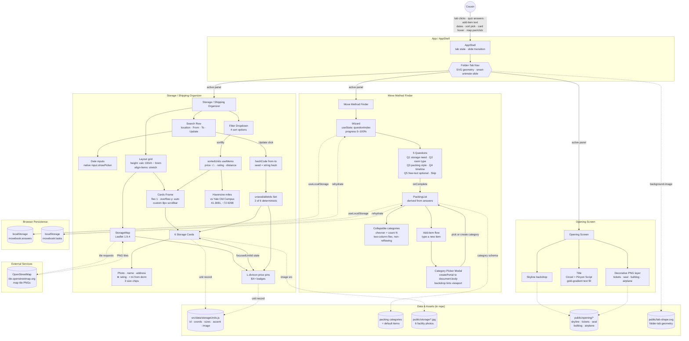

# Persons Required — The Move Book
**SCAD AI 201 — Project 3 (Capstone)**

> A tool built for one real person, one real problem.

---

## Design Argument

My project is aimed at a real person, Hannah, my cousin, who is about to finish high school and go to Yale University in the fall. The issue I found is that relocating from Atlanta to New Haven involves not just one task, but a series of overwhelming choices about what to pack, what she still requires, and how to get ready for a new place. Through discussions and online user testing with Hannah, I discovered that the most beneficial approach was not a general college application, but a specific planning tool that could help her feel more organized before the move.

This research led to the main feature, the Move Method Finder, which utilizes a quiz to create a personalized packing list instead of making her start from the beginning. The option to modify the list, check off items that are packed, and indicate what she still needs was designed to align with how packing actually occurs over time, rather than all at once.

The second key feature, the Storage Unit Finder, was added because moving out of state can lead to uncertainty about what to do with extra items, seasonal belongings, or things that might not fit in a dorm. This feature assists Hannah in exploring storage options near New Haven and comparing prices, making the tool more relevant for her specific move instead of functioning as a generic checklist. My definition of "helped" is that Hannah should be able to navigate the site and leave with a clearer idea of what she needs to pack, what she still has to acquire, and what storage solutions are available if necessary. The visual design also reinforces the idea because the travel-book style presents this transition as a journey from Atlanta to New Haven, making the experience feel more personal and less stressful. Every significant design choice was influenced by Hannah's circumstances, her feedback, and the aim of alleviating the stress of preparing for an out-of-state college move.

---

## Research Documentation

*Evidence gathered about the Person, the Problem, and the surrounding context — interviews, observations, references, alternatives surveyed. Student-authored.*

**TBD.**

---

## Platform Rationale

I chose to build this project as a desktop-focused website because the experience needs enough space to support planning, comparing, and organizing information clearly. Since Hannah Le is preparing for a major out-of-state move, the site needs to handle more complex features. A desktop layout makes sense because she would most likely use this while sitting down to seriously plan her move, compare options, and talk through decisions with family. The storage finder especially benefits from a larger screen because it includes search fields, date filters, storage unit cards, pricing, and a map view all in one place. If this were designed only as a mobile app, those features could feel cramped and harder to compare side by side. A website also makes the tool easier to access without requiring Hannah to download anything during an already busy transition. The platform choice supports the problem because the goal is not quick daily use, but focused planning for a specific life event. This is why a desktop web experience is the right format for helping her organize packing decisions and storage options in one clear place.

---

## AI Direction Log

*Decisions where AI was directed, with what was asked for, what came back, and what was kept or changed. Covers the full arc from pipeline setup to last-mile polish.*

| # | Date | Prompt | AI Output | Decision | Notes |
|---|------|--------|-----------|----------|-------|
| 1 | 2026-05-13 | "Hosting a Vite app in this folder, GitHub Pages via Actions. Do not build anything until I give you documentation." | Asked for assignment docs first, saved them to `claude/docs/`. Then set up Vite 5.4 + React 18.3 (JS, not TS — matches P1/P2), `vite.config.js` with `base: '/PersonsRequired/'`, and a GitHub Actions workflow that deploys to Pages on push to `main`. | **Kept** | Foundation for everything that followed. |
| 2 | 2026-05-13 | "Build out in high-fi and with animation" + 21 Figma screenshots across three surfaces. | Scaffolded all three surfaces in one pass — `AppShell` with tab nav, three panel components, design tokens, base CSS, Cinzel + Pinyon Script + Cormorant Garamond + Inter type system, navy/gold/cream palette. | **Kept (structure) / Revised (contents)** | ~40 pixel-level iterations followed — image positions, scale, font sizes, spacing. |
| 3 | 2026-05-13 | "You forgot the quiz entirely. It should be that they take the quiz and then it generates the 'personalized' recommended list." | Rebuilt MMF as a 5-step `Wizard` (storage need → room type → packing style → timeline → optional free-text) with progress bar, single-select toggle, back-clears-Q1, Skip on Q5. Quiz output drives the packing list contents. | **Revised** | Without the quiz the list is generic — same as the cousin's Notes app. Quiz is what makes it hers. |
| 4 | 2026-05-13 | "It feels a bit overwhelming looking at all the items. Make it a drop down. Display the number of items in each category in parentheses." | Wrapped categories in `
`-style collapsibles with chevron + `(N)` count. First used CSS `columns: 2` — caused right column to reflow when left expanded. Replaced with two independent flex columns (even-index left, odd-index right). | **Revised** | Two iterations: first the dropdown, then the non-reflowing column fix. |
| 5 | 2026-05-13 | "When you add an item and the pop up shows up, it should be just the pop up that shows with the background tinted." | First rendered inline `position: fixed` — backdrop didn't reach viewport edges because `.shell__panel` ancestor had a `transform` (creates a containing block for fixed-positioned descendants). Re-rendered via `createPortal(..., document.body)`. | **Revised** | Platform-specific React/CSS gotcha worth documenting. |
| 6 | 2026-05-13 | Folder-tab shape feedback over many rounds ("the bottom is cut off bruh", "still not quite"). | First tried CSS `clip-path: polygon(...)`; polygons can't represent concave-with-tails without faceting. Switched to SVG (`public/tab-shape.svg`) as `background-image` with `preserveAspectRatio="none"` and cropped `viewBox`. Fixed inverted arc sweep-flag (`0` → `1`) so top corners convex. | **Revised** | High iteration cost, but final result is one SVG file driving every tab state. |
| 7 | 2026-05-13 | "The map is too small and not built out fully so it just looks like the user is moving a picture." | Replaced CSS-art map wholesale with Leaflet 1.9.4 + OpenStreetMap tiles (no API key, no signup). | **Kept** | Bundle 170 → 320 KB. First and only new npm dep since project setup. Real geography for someone moving to an unfamiliar city. |
| 8 | 2026-05-13 | "Can we add pictures to the storage units to replace the placeholders." Person provided 6 PNGs mapped per facility. | Compressed PNG → JPEG via `sips` (q82, max 1200px), placed in `public/storage/<unit-id>.jpg`. Added `image` field to each unit using `${import.meta.env.BASE_URL}storage/<id>.jpg` (required for the GitHub Pages subpath). Replaced inline warehouse SVG with `` over accent-color fallback. | **Kept** | ~1.3 MB total assets; bundle unchanged. |
| 9 | 2026-05-13 | "Frame the left side storage option to match the height of the map, making users scroll to see all." | First attempt: sticky `max-height` cap on the results column. Rejected as "squished." Re-implemented by moving the height constraint up to `.storage__layout` itself: `height: calc(100vh - 6rem)` with `align-items: stretch`. Cards live in a `.storage__cards-frame` with `flex: 1; overflow-y: auto`. Then stripped the visible border on request; kept `padding-right: 0.75rem` so cards don't sit flush against the scrollbar. | **Revised** | Mobile fallback (≤980px) reverts to natural flow — no nested scroll. |
| 10 | 2026-05-13 | "When users add dates for From and To, have it so when they click Update it shuffles the availability of storage units." | Added `appliedDates` state. Hash of `from\|to` ranks the 6 units; bottom 2 marked `_unavailable` — grayscale photo, "Not available" badge, faded body, `aria-disabled`, `tabIndex=-1`. Pins fade. `key={from-to}` on the `<ul>` triggers a 380ms fade-up animation. | **Kept** | Same dates always yield the same 2 unavailable. Dropped "X available for [dates]" copy at user request — shuffle + badges already communicate it. |

---

## Records of Resistance

*Every product-level moment where AI output was rejected, significantly revised, or where AI deliberately declined a default. Grouped by checkpoint in chronological order. README-related checkpoints (CP02, CP16–CP20) are excluded because their resistance is about documentation, not the prototype itself. Detailed context for every entry lives in [`claude/checkpoints/`](claude/checkpoints/).*

### CP01 — Pipeline Setup

| # | What AI Produced | Why It Was Rejected | What Was Done Instead |
|---|------------------|---------------------|------------------------|
| R1 | Wanted to scaffold the Vite app immediately. | User enforced reading the assignment docs first before any building. | Read all assignment docs from `claude/docs/`, then scaffolded. |
| R2 | Offered the latest Vite 7 / React 19 stack. | User chose continuity with P1/P2 to avoid learning new patterns under deadline. | Set up Vite 5 / React 18 to match prior project stack. |
| R3 | When asked JS vs. TS, proposed a recommendation in the abstract. | User wanted answers grounded in her actual prior-repo evidence, not generic advice. | Checked `test2` and `ReactiveSandbox` first, confirmed JS was her existing pattern. |
| R4 | Assumed P3 would extend P2's "favorite toy" per framework continuity language. | User corrected: P3 is a fresh build, not a P2 continuation. | Treated this as a standalone capstone with its own Person and Problem. |

### CP03 — Move Book Build

| # | What AI Produced | Why It Was Rejected | What Was Done Instead |
|---|------------------|---------------------|------------------------|
| R1 | A quiz that produced the same canned list regardless of answers. | Without real branching the quiz couldn't serve the "finishes without abandoning halfway" success criterion. | Built quiz answers that genuinely reshape which items appear in the list. |
| R2 | Proposed integrating Leaflet or Google Maps right out of the gate. | Premature for first pass — the cousin hadn't even looked at storage yet, so a real map was over-engineering. | Used CSS-art map with pins as a placeholder direction (later replaced in CP11). |
| R3 | Wanted to hand-code title / tickets / seal / bulldog / airplane as SVGs. | The originals' textured fidelity couldn't be matched in reasonable time. | Layered flat Figma PNG exports as backgrounds — trading bandwidth for visual quality. |
| R4 | Could have used frame 09's baked-in Start button. | A flat PNG button has no hover / focus / active states. | Built a JSX button with proper interactive states. |
| R5 | Default build would have skipped `prefers-reduced-motion` support. | The cousin (or graders) might have the OS preference enabled — animation should respect it. | Added a reduced-motion override that snaps to final state immediately. |

### CP04 — Opening Screen Rebuild

| # | What AI Produced | Why It Was Rejected | What Was Done Instead |
|---|------------------|---------------------|------------------------|
| R1 | Instinct to redraw tickets / seal / bulldog / airplane as SVG. | Original assets' textured fidelity is unreproducible in code on this timeline. | Used Tina's individual PNG assets directly as image layers. |
| R2 | Offered a baked PNG export of the title for pixel-exact fidelity. | Absent her explicit request, a code-rendered title scales sharper at any size. | Rendered title in CSS with Cinzel + Pinyon Script + gold gradient. |
| R3 | Pure viewport-percentage positioning for decorative elements. | On wide monitors elements fled to the corners, breaking the composition. | Anchored the layout to a centered `max-width: 1440px` stage. |
| R4 | Offered fuller / flourish-heavier script alternatives (Allura, Great Vibes, Italianno). | Their heavier strokes didn't match the Figma's elegant fine-line cursive. | Picked Pinyon Script for its thin copperplate stroke. |
| R5 | Could have proportionally shrunk "The" when MOVE/BOOK was scaled down. | Tina never explicitly requested it — inferring would override her decisions. | Left "The" alone across multiple MOVE/BOOK rescales. |
| R6 | An earlier `mix-blend-mode: screen` on the bulldog asset. | It washed the bulldog out, losing the soft watermark feel. | Replaced with plain opacity to match the Figma's intent. |

### CP05 — Tabs List and Polish

| # | What AI Produced | Why It Was Rejected | What Was Done Instead |
|---|------------------|---------------------|------------------------|
| R1 | Wanted to add a JavaScript masonry library (react-masonry-css, masonic) for uneven row heights. | An npm dep for one layout problem is overkill. | Six lines of CSS columns + `break-inside: avoid` solved it. |
| R2 | A sophisticated radial + linear gradient veil for the skyline tint. | Too noisy — Tina wanted a uniform feel. | Single flat `rgba` tint. |
| R3 | Offered to flip the bulldog's colors via CSS filters to match Figma's darker linework. | Tina didn't ask — don't change assets she's happy with. | Left the bulldog as-is. |
| R4 | When Tina said "you forgot the quiz entirely," initial instinct was to rewrite the wizard. | Misdiagnosis — the quiz existed but stale localStorage was routing past it. | Cleared storage / surfaced the Redo link rather than rebuilding the wizard. |

### CP06 — Folder Tabs / Quiz Slide

| # | What AI Produced | Why It Was Rejected | What Was Done Instead |
|---|------------------|---------------------|------------------------|
| R1 | `clip-path: polygon()` with many vertex iterations for the folder tab shape. | Polygons can't represent concave fillets + tail protrusions without visible faceting. | Switched to a Figma-exported SVG used as `background-image`. |
| R2 | Original SVG's tiny cubic Bezier top corners. | First attempt with sweep-flag 0 rendered concave (inset) instead of convex. | Rewrote top corners as explicit `A` arc commands with sweep-flag 1. |
| R3 | Could have wired the 5th-question free-text into `listGenerator.js` immediately. | Keyword-based shaping is its own design problem; not in scope for this checkpoint. | Captured notes to localStorage; deferred keyword shaping. |
| R4 | Considered JS measurement / restructuring tabs+body into one element for the manila-folder visual. | Adds runtime measurement complexity for what's fundamentally a visual effect. | Used the SVG's tail extensions to imply tab→body merging within the tab's own bounds. |
| R5 | Could have built JS-driven height tracking so the two panels' heights match exactly. | Adds DOM measurement + ResizeObserver complexity for a minor visual asymmetry. | Accepted that grid-stacked panels share the taller panel's height. |

### CP07 — Wizard Polish

| # | What AI Produced | Why It Was Rejected | What Was Done Instead |
|---|------------------|---------------------|------------------------|
| R1 | A gold-gradient Next button matching the opening Start CTA. | Too prominent for the muted wizard background — pulled focus the wrong way. | Reverted to a black button. |
| R2 | Multiple `.wizard__actions` scale attempts that visually didn't apply. | Keyframe `transform: translateY(0)` was overriding the static `scale()` on the same property. | Bundled the scale into the keyframe transforms so they compose correctly. |
| R3 | Early back-button placement with `align-self: flex-end; margin-top: -2.5rem`. | Lifted the Back button out of view entirely. | Relocated Back to a chevron beside the progress bar. |
| R4 | A "select once and you're locked in" single-select behavior. | No parity with multi-select; couldn't undo an accidental choice without using Back. | Allowed re-clicking a selected choice to deselect it. |

### CP08 — Collapsible Packing List

| # | What AI Produced | Why It Was Rejected | What Was Done Instead |
|---|------------------|---------------------|------------------------|
| R1 | Default state of "all categories expanded." | Tina said the list felt overwhelming — expanded-by-default makes that worse. | Default state is collapsed; the cousin reveals categories as she's ready. |
| R2 | Parenthesized item count always showing the category total. | Inconsistent with the active filter (Active / Completed) above the list. | Count reflects the current filter, so the number always matches what's visible. |
| R3 | CSS columns layout carried over from CP05. | CSS columns reflow on height change, breaking the just-added collapsibility. | Switched back to grid layout with `align-items: start`. |

### CP09 — Category Picker Modal

| # | What AI Produced | Why It Was Rejected | What Was Done Instead |
|---|------------------|---------------------|------------------------|
| R1 | Inline `position: fixed` modal. | Ancestor `.shell__panel` has a `transform`, which creates a containing block and breaks fixed positioning at the viewport. | Portaled the modal to `document.body` via `createPortal`. |
| R2 | Grid layout with `align-items: start` for the two-column categories. | Grid still synced row heights, so expanding one category shifted the other column. | Switched to two independent flex column stacks (even-index left, odd-index right). |
| R3 | Considered pre-creating new items in "Other" and letting the user recategorize later. | Adds clutter and reading load — defeats the "list feels organized" goal. | Forced category choice up front in the modal before the item appears in the list. |
| R4 | A soft `0.45` backdrop dim. | Tina wanted unambiguous focus on the modal, not a subtle veil. | Bumped to `0.6` opacity + blur for a system-dialog feel. |

### CP10 — Header Tint

| # | What AI Produced | Why It Was Rejected | What Was Done Instead |
|---|------------------|---------------------|------------------------|
| R1 | Could have darkened or replaced the skyline JPG to deepen the header. | Touching the source asset would diverge from the unified asset palette used elsewhere. | Adjusted only the gradient overlay, leaving the JPG untouched. |
| R2 | A gradient with both stops semi-transparent for symmetric tinting. | Bottom transparency let a ghost-skyline peek through where the tab meets the body. | Top at 0.82 for atmospheric glow; bottom at 1.0 fully opaque to hide the seam. |

### CP11 — Leaflet Map

| # | What AI Produced | Why It Was Rejected | What Was Done Instead |
|---|------------------|---------------------|------------------------|
| R1 | The CSS-art map from CP03 ("just looks like you're moving a picture"). | Drag-panning a static abstraction revealed no real geography — useless to someone unfamiliar with New Haven. | Replaced wholesale with Leaflet + OpenStreetMap; accepted the ~140 KB bundle cost (170 → 320 KB) because the value to the Person is much higher. |
| R2 | Could have added `react-leaflet` for declarative React wrapping. | Adds a second dep for a thin wrapper around an imperative API that's only ~50 lines. | Used raw Leaflet with `useEffect` + `useRef` directly. |
| R3 | Considered calling a geocoding service (Nominatim, Mapbox) at render time for precise coordinates. | Network call at render, plus rate-limit / signup complexity, for a demo where neighborhood-level accuracy is enough. | Hand-picked approximate lat/lng from each facility's address. |
| R4 | Considered diffing markers and updating only the changed ones on each render. | Premature optimization for six markers. | Clear-and-rebuild all markers on each state change — correct and simple. |

### CP12 — Storage Photos

| # | What AI Produced | Why It Was Rejected | What Was Done Instead |
|---|------------------|---------------------|------------------------|
| R1 | Bare `/storage/<id>.jpg` paths in the data file. | Works in dev (Vite serves from `/`), 404s on GitHub Pages (site is under `/PersonsRequired/`). | Used `${import.meta.env.BASE_URL}storage/<id>.jpg` so Vite substitutes the correct base at build time. |
| R2 | Considered CSS `background-image: url(...)` for the card photos. | Loses lazy-loading, no `onError` fallback, no semantic value, harder to feature-flag per unit. | Used `` with `loading="lazy"` and `onError={hide}`. |
| R3 | Kept the `.storage-card__image::before` overlay gradient from the placeholder era. | Designed to make a white warehouse SVG pop on flat color; over real photos it just washes them out. | Deleted the overlay entirely. |
| R4 | Considered removing the colored `--accent` background since photos cover it. | If any image fails to load, the card would become a blank empty header. | Kept the accent background as a graceful fallback under the ``. |
| R5 | Considered shipping WebP/AVIF with a `<picture>` element and multiple sizes. | Production-grade asset pipeline for a 130 px thumbnail in a school project is overkill. | Compressed PNG → JPEG via `sips` at quality 82, max edge 1200px. |

### CP13 — Storage Card Polish

| # | What AI Produced | Why It Was Rejected | What Was Done Instead |
|---|------------------|---------------------|------------------------|
| R1 | First scrollable-frame attempt: sticky `max-height` on the results column with cards scrolling inside. | Heading + count ate too much of the capped height; cards came out "squished"; columns weren't actually forced to equal heights. | Moved the height constraint up to `.storage__layout`: `height: calc(100vh - 6rem)` with `align-items: stretch`. |
| R2 | Visible bordered "framed container" look (border + cream-panel background + padding). | Tina wanted only the scroll behavior, not the chrome. | Stripped border / background / padding; kept `padding-right: 0.75rem` so cards don't sit flush against the scrollbar. |
| R3 | A hand-picked hex (`#9a9a9a`) for the `•` bullet separator color. | Adds a one-off color outside the palette tokens. | Switched to `var(--color-muted)` (`#94a0b3`) so the bullet stays palette-consistent. |
| R4 | Considered removing the map's `aspect-ratio: 4/5` since grid stretch overrides it on desktop. | Still load-bearing on mobile single-column layout where grid stretch doesn't apply. | Left the rule in place — it's a no-op on desktop but correct on mobile. |

### CP14 — Date Availability

| # | What AI Produced | Why It Was Rejected | What Was Done Instead |
|---|------------------|---------------------|------------------------|
| R1 | First instinct: pick unavailable units randomly each Update click via `Math.random()`. | Same dates yielding different results would break trust — feels like the date doesn't matter. | Used a hash of `from\|to` as the seed; same dates always produce the same 2 unavailable units. |
| R2 | Variable count of unavailable units (sometimes 1, sometimes 3, based on a second hash). | With only 6 units, hitting 0 or 5 unavailable for some date pairs would look glitchy. | Constant 2 of 6 unavailable — predictable visual rhythm. |
| R3 | Considered filtering unavailable units out of the list entirely. | The cousin should *see* which facilities aren't available — useful info, plus a stable layout. | Pushed unavailable units to the bottom with grayscale + badge; kept the card count constant. |
| R4 | Considered FLIP (First-Last-Invert-Play) animation via the Web Animations API for a true reshuffle. | Overkill — ~100 lines of plumbing for a "the list updated" cue. | Used `key={from-to}` on the `<ul>` to force remount + a single 380 ms CSS keyframe fade-up. |
| R5 | An "X available for [dates]" status line below the count. | Redundant — the shuffle, badges, and grayscale already communicate the change. | Removed the line at Tina's request; kept the original count copy. |
| R6 | Considered routing unavailable cards to a "this is unavailable" modal on click. | Over-engineered for a demo — affordance can be added later if needed. | Just used `tabIndex={-1}`, `aria-disabled`, and gated hover/focus handlers. |

### CP15 — Scroll Frame Clip Fix

| # | What AI Produced | Why It Was Rejected | What Was Done Instead |
|---|------------------|---------------------|------------------------|
| R1 | Considered `overflow: visible` on the frame, or removing the card hover `translateY(-2px)`. | `overflow: visible` defeats scrolling; removing the lift breaks visual consistency with the rest of the app. | Added `padding: 8px 0.75rem 8px 0` so the lift has room within the scroll viewport. |
| R2 | Could have left the 8 px padding to shift the first card row down 8 px from its prior position. | Visibly different from before — looks like an unintentional layout shift. | Subtracted 8 px from the count's `margin-bottom` (`calc(1.25rem - 8px)`) to keep the visual spacing identical. |

---

## Five Questions Reflection

### Can I defend this?
Yes, I can support this project because every key decision relates back to my cousin, Hannah Le, and the change she is about to face. I decided to create The Move Book because Hannah is graduating from high school and getting ready to go to Yale University in the fall, which means she is relocating from Atlanta to New Haven and stepping into a new level of independence. The choice to emphasize the Move Method Finder came from the realization that one of the most daunting aspects of moving to college is figuring out what to pack, what is truly necessary, and what can be left behind. I also added a storage unit feature because storage is important for an out-of-state move, especially if Hannah needs to look at nearby options, prices, and locations around New Haven. I can clarify the quiz format because it provides Hannah with a structured starting point rather than having her create a packing list from the ground up. I can also justify the travel-book visual style because the project focuses on a personal journey, so the interface should feel transitional, supportive, and connected to the concept of starting a new chapter.

### Is this mine?
This project belongs to me because I made all the decisions regarding the original concept, user, design direction, and functionality. I selected Hannah as my design focus because her journey from high school in Atlanta to college at Yale was personal, specific, and significant. AI assisted me in developing my ideas, improving my writing, and considering how to enhance the flow, but it did not dictate the project's direction. The visual style, which includes the travel-book concept, gold typography, the route from Atlanta to New Haven, and stamp-inspired elements, originated from the creative direction I wanted to pursue. I also determined the functionality choices, such as the quiz-based Move Method Finder and the storage unit discovery feature, as they seemed most beneficial for Hannah's transition. AI served as a supportive tool, but the final project showcases my own thoughts, design decisions, and insights into what would best assist my user.

### Did I verify?
I confirmed the project by ensuring that the flow was logical for someone getting ready to move out of state for college. I looked over the experience from the landing page through the quiz questions to the packing list generated, ensuring each step had a clear purpose. I also verified that the quiz questions related to the suggested items, so Hannah wouldn't feel like she was just answering random questions. Keeping the search for storage units was sensible because it provides her with a practical way to compare local options and prices if she needs storage near New Haven. I made sure that the product remained focused on assisting her with the move rather than turning into a general college planning tool. However, I still believe that the best verification came from Hannah using the prototype herself and sharing what she finds helpful, missing, or unnecessary.

### Would I teach this?
Yes, I would teach this because I clearly understand the purpose, structure, and design choices of the project. I could explain that The Move Book is not just a standard college checklist, but a tailored packing and storage planner for Hannah as she gets ready to move from Atlanta to New Haven. I could guide someone through the reason the experience begins with a quiz, as it reduces the stress of planning by asking straightforward questions and converting the responses into a suggested packing list. I could also clarify how Hannah can modify the list, check off items she has packed, and indicate what she still needs. I see the value in keeping the storage feature in the project because comparing storage units, locations, and prices can help her move in a practical manner. I could teach both the UX reasoning and the visual approach, including how the travel-book style enhances the concept of a personal journey and a new chapter.

### Is my documentation honest?
My documentation is truthful as it shows how the project truly evolved and the decisions I made during the process. I started with an out-of-state college move planner and shaped it around what would be most useful for Hannah. I also performed online user testing with Hannah and recorded her feedback to ensure the project met her actual needs and desires, rather than just my assumptions about what would be useful. Her feedback helped me confirm the direction of the Move Method Finder, the packing suggestions, and the storage unit search feature. My AI Direction Log should demonstrate that I utilized AI to develop feature logic and enhance visual instructions, but I continued to make choices based on Hannah's needs and my own design insights. The documentation is honest because it illustrates both the assistance AI provided and the user-focused decisions I made to adapt the final project to Hannah's genuine transition.

---

## Post-Mortem

*Written reflection on the full Design Cycle for the capstone. Submitted with the case study at Session 20. Student-authored.*

**TBD.**

---

## Mermaid Diagram

What receives input, how the system processes it, and what it outputs. Subgraphs group the three runtime surfaces; the right column shows the data sources, external services, and browser persistence that everything reads from / writes to.

---

## User Testing Evidence

*Photos, recordings, quotes, and observations from Session 16 (5/13/26) when the prototype is put in front of the Person. Student-authored.*

**TBD.**

---

## Live URL

https://tinale21.github.io/PersonsRequired/
