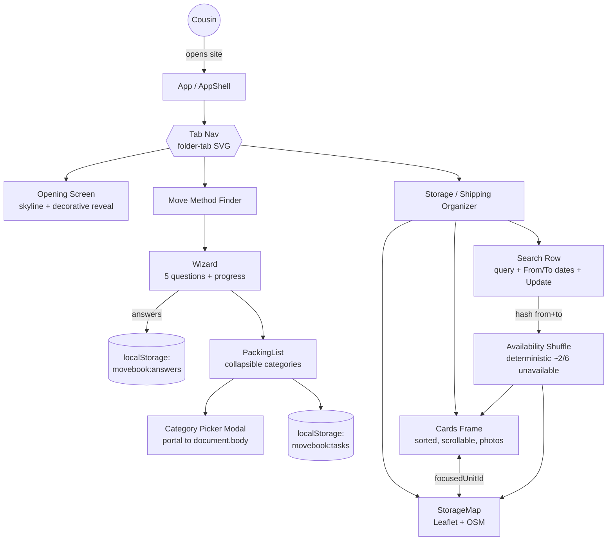

# Persons Required — The Move Book
**SCAD AI 201 — Project 3 (Capstone)**

> A tool built for one real person, one real problem.

**Live URL:** https://tinale21.github.io/PersonsRequired/

**Status:** High-fidelity prototype shipped across all three surfaces (Opening, Move Method Finder, Storage / Shipping Organizer). Student-authored sections (Design Argument, First Contact, Five Questions Reflection, Post-Mortem) still pending.

---

## Design Argument

*The pre-AI document: who the Person is, what the Problem is, what "helped" looks like, the Qualification, the Platform Decision, and the Non-Negotiables. Student-authored.*

**TBD.**

---

## What's Built

The Move Book is a three-surface web app for the cousin (Atlanta → Yale, fall 2026):

### 1. Opening Screen
Animated reveal of the New Haven skyline with the title (Cinzel + Pinyon Script, gold gradient), layered decorative elements (tickets, seal, bulldog, airplane). Sets the tone before the working tools.

### 2. Move Method Finder
A 5-question quiz (storage need, room type, packing style, timeline, optional free-text) → generates a categorized packing list. Quiz features: percentage progress bar, single-select toggle (click to deselect), back navigation that clears Q1's answer, optional 5th question with Skip. Packing list features: collapsible categories with item counts, two-column layout that doesn't reflow when one side expands, add-item flow with a portal-mounted category picker modal (background dim, escape viewport-edge clipping). Answers + task state persist via `localStorage`.

### 3. Storage / Shipping Organizer
Search row (location query, From/To date pickers via native `showPicker()`, Update button). Two-column layout sharing one fixed-height grid row (`calc(100vh - 6rem)`):
- **Left:** scrollable results frame with 6 cards (real facility photos, rating, miles from Yale Old Campus via Haversine, three size chips with prices). Sort filter dropdown (price asc/desc, star rating, distance from dorm). Internal scroll, custom 8px scrollbar.
- **Right:** real interactive Leaflet map of New Haven (drag, scroll-wheel/pinch zoom, OpenStreetMap tiles, custom `divIcon` price-badge pins). Cards ↔ pins sync via shared `focusedUnitId` state.

Clicking **Update** with both dates filled triggers a deterministic availability shuffle: a hash of `from|to` marks 2 of 6 units `_unavailable` (grayscale photo, dark "Not available" badge, faded body, `aria-disabled`, `tabIndex=-1`), pushes them to the bottom of the sorted list, fades the corresponding map pins, and plays a 380ms fade-up animation on the cards grid. Same dates always produce the same result (feels like a real availability check).

---

## Tech Stack

- **Vite 5.4** + **React 18.3** (JavaScript, not TypeScript — matches prior P1/P2)
- **Vanilla CSS** with design tokens (Cinzel, Pinyon Script, Cormorant Garamond, Inter; navy/gold/cream palette)
- **Leaflet 1.9.4** + **OpenStreetMap** tiles (no API key, no signup)
- **localStorage** (`movebook:answers`, `movebook:tasks`) for persistence between sessions
- **GitHub Pages** deploy via `.github/workflows/deploy.yml` on push to `main`

---

## Mermaid Diagram



---

## AI Direction Log

*Decisions where AI was directed, with what was asked for, what came back, and what was kept or changed. Covers the full arc from pipeline setup to last-mile polish.*

### Entry 1 — Platform & pipeline decision
**Directed:** "Hosting a Vite app in this folder, GitHub Pages via Actions. Do not build anything until I give you documentation."
**AI did:** Asked for assignment docs first (saved to `claude/docs/`), confirmed project parameters before writing code. Set up Vite 5.4 + React 18.3 (JavaScript, not TypeScript — matching prior P1/P2 stack), `vite.config.js` with `base: '/PersonsRequired/'` for the GitHub Pages subpath, GitHub Actions workflow that builds on push to `main` and deploys to Pages.
**Kept.** Foundation for everything that followed.

### Entry 2 — Three-surface scaffolding from Figma screenshots
**Directed:** "Build out in high-fi and with animation" with 21 Figma screenshots across Opening Screen, Move Method Finder, and Storage / Shipping Organizer.
**AI did:** Built initial scaffold of all three surfaces in one pass — `AppShell` with tab nav, three panel components, design tokens, base CSS. Used Cinzel + Pinyon Script + Cormorant Garamond + Inter as the type system; navy/gold/cream palette from the screenshots.
**Kept the structure; revised the contents** across roughly 40 pixel-level iterations (image positions, scale, font sizes, spacing).

### Entry 3 — Move Method Finder rebuilt to include the quiz
**Directed:** "You forgot the quiz entirely. It should be that they take the quiz and then it generates the 'personalized' recommended list."
**AI did:** Original build went straight to a packing list with no precursor. Rewrote as a 5-step `Wizard` component (storage need → room type → packing style → timeline → optional free-text) with progress bar, single-select toggle (click to deselect), back navigation on Q1 that clears the answer, and a Skip button on the optional 5th question. Quiz output drives the packing list contents.
**Kept.** Without this, the list isn't actually "personalized" — it's just a checklist, which the Person already has in her Notes app.

### Entry 4 — Packing list: flat → collapsible categorized with counts
**Directed:** "It feels a bit overwhelming looking at all the items. Is there a way to make it a drop down. And the number of items in each category be display in parentheses."
**AI did:** Wrapped each category in a `<details>`-style collapsible with a chevron and `(N)` count next to the title. First implementation used CSS `columns: 2` for the two-column layout, which reflowed the right column when the left expanded ("the other category disappears"). Replaced with two independent flex columns (even-index left, odd-index right) so expansion is local to one side.
**Kept.** Two iterations: first the dropdown, then the non-reflowing column fix.

### Entry 5 — Modal portal to escape transform stacking context
**Directed:** "When you add an item and the pop up shows up, it should be just the pop up that shows with the background tinted."
**AI did:** First attempt rendered the category-picker modal inline with `position: fixed`, but the backdrop didn't reach viewport edges. Root cause: `.shell__panel` had a `transform` (the smart-animate slide), which creates a containing block for fixed-positioned descendants. Fixed by rendering the modal via `createPortal(..., document.body)` so it escapes the transformed ancestor.
**Kept.** Platform-specific quirk worth documenting — fixed positioning inside a transformed parent is a frequent React/CSS gotcha.

### Entry 6 — Folder tab shape: clip-path → SVG background
**Directed:** Initial folder-tab shape needed concave bottom corners with downward tails (the "tab" of a folder file). Many polygon iterations failed ("the bottom is cut off bruh"; "still not quite").
**AI did:** First attempted CSS `clip-path: polygon(...)`. Polygons can't represent concave-with-tails reliably without faceting. Switched to an SVG (`public/tab-shape.svg`) used as `background-image` with `preserveAspectRatio="none"` and a cropped `viewBox`. Top corners initially rendered concave (sweep-flag inverted); fixed by flipping the arc sweep-flag from `0` → `1`.
**Kept.** Iteration cost was high but final result is a single SVG file driving all tab states.

### Entry 7 — Storage map: CSS abstract → Leaflet + OpenStreetMap
**Directed:** "The map is too small and not built out fully so it just looks like the user is moving a picture."
**AI did:** Initial map was CSS-only — gradients for land/water, SVG roads, absolutely-positioned price pins. Drag-pan revealed no actual geography. Replaced wholesale with Leaflet 1.9.4 + OpenStreetMap tiles (no API key, no signup). New dep is ~140 KB minified (bundle grew 170 KB → 320 KB); accepted trade-off because the value to the cousin (a real map of where the facilities actually are in New Haven) is much higher than the load-time cost. Used raw Leaflet, not `react-leaflet`, to avoid a second dep for a thin wrapper.
**Kept.** First and only new npm dep added since project setup.

### Entry 8 — Storage card photos: colored placeholders → real images
**Directed:** "Can we add pictures to the storage unit to replace the placeholders." Person sourced six PNGs and mapped each to a facility.
**AI did:** Compressed PNG → JPEG via `sips` (quality 82, max edge 1200px); placed in `public/storage/<unit-id>.jpg`. Added `image` field to each unit in `src/data/storageUnits.js` using `${import.meta.env.BASE_URL}storage/<id>.jpg` (the BASE_URL prefix is required because the site is hosted under `/PersonsRequired/` on GitHub Pages, not at root). Replaced the inline warehouse SVG placeholder in each card with `` over the accent-colored background — fallback shows the colored block if the image ever fails.
**Kept.** Total `public/storage/` is ~1.3 MB across six files; bundle unchanged.

### Entry 9 — Scrollable results frame matching map height
**Directed:** "Frame the left side storage option to match the height of the map, making users scroll to see all."
**AI did:** First attempt put a sticky `max-height` cap on the results column itself and made the cards list scroll inside it. Rejected as "squished" — the heading + count above ate too much of the capped height, and the two columns weren't actually forced to equal heights. Re-implemented by moving the constraint up to `.storage__layout` itself: `height: calc(100vh - 6rem)` with `align-items: stretch` so both grid children share the same row height. Cards live in a `.storage__cards-frame` wrapper with `flex: 1; overflow-y: auto`. Tina then asked to strip the visible border — kept only the scroll behavior, with `padding-right: 0.75rem` so cards don't sit flush against the custom 8px scrollbar.
**Kept.** Mobile fallback (≤980px) reverts to natural flow — no nested scroll.

### Entry 10 — Update button: idle → deterministic availability shuffle
**Directed:** "When users add dates for From and To, have it so when they click Update it shuffles the availability of storage units."
**AI did:** Before: Update was a no-op. After: clicking Update with both dates set captures them in `appliedDates`, runs a small string hash over `from|to`, ranks the 6 units by that hash, and marks the bottom 2 as `_unavailable`. Same dates always produce the same 2 unavailable units (deterministic — feels like a real availability check, not a roll of the dice). Unavailable cards push to the bottom of the sort, get a grayscale photo + "Not available" badge + `aria-disabled`; their map pins also fade. Card list gets a `key={from-to}` that triggers a 380ms fade-up animation when the dates change.
**Kept.** Tina also asked to drop the proposed "X available for [dates]" copy line — the shuffle + badges already communicate the change.

---

## Records of Resistance

*Three documented moments where AI output was rejected or significantly revised. Emphasis on Person-level resistance (where the rejection was grounded in what the cousin would actually need), not just visual preferences. Sixteen pre-commit checkpoints in [`claude/checkpoints/`](claude/checkpoints/) document the full iteration arc — each captures context, human directions, resistance moments, and successes for that commit.*

### Resistance 1 — "You forgot the quiz entirely"
**What AI shipped:** A Move Method Finder that went straight into a flat packing list with all categories visible. No quiz precursor.
**Why it was rejected:** The packing list was generic — same items for everyone. The Person's measurable definition of "Helped" is *"she finishes a packing decision list without abandoning it halfway."* A generic list with bedding for someone who lives in a single dorm room, or with kitchen tools for someone on a meal plan, is exactly the kind of mismatch that causes abandonment. The quiz is what makes the list *hers* — without it, the surface is just a fancier version of her Notes app.
**Revision:** Rebuilt as a 5-step `Wizard` that filters which items appear in which categories. The optional 5th free-text question ("Anything else you'd like us to know?") leaves room for context the quiz didn't anticipate.

### Resistance 2 — "It just looks like the user is moving a picture"
**What AI shipped:** A CSS-art map for the Storage / Shipping Organizer — gradients for land/water, SVG roads, absolutely-positioned price pins, drag-pan enabled.
**Why it was rejected:** The cousin is moving to New Haven from Atlanta and has never been there. The map's whole reason for existing is to help her see *where* a storage facility actually sits relative to where she'll live. A CSS abstraction with drag-pan looked correct from afar but revealed no actual geography when you used it — no street names, no neighborhoods, no real distance information. It would have failed the cousin the first time she tried to use it for the thing it was supposed to do.
**Revision:** Replaced wholesale with Leaflet + OpenStreetMap. Accepted the ~140 KB bundle cost (170 KB → 320 KB) because the value to the Person was much higher than the load-time penalty. Now she can pan around and see the real streets near each facility.

### Resistance 3 — "Can we add pictures to the storage units to replace the placeholders"
**What AI shipped:** Each storage card had a colored block header tinted with the unit's accent color, with a small stylized white "warehouse" SVG centered on top. Visually clean, but no information.
**Why it was revised:** The cousin will choose a storage facility sight-unseen, from another state, two months before she arrives. She has no way to drive past these places to vet them. A generic warehouse icon doesn't tell her whether the facility looks well-kept, what the gate situation is, whether it's a converted retail building or a purpose-built storage facility. The cousin sourced six real photos herself and mapped each to a facility — Person-level resistance in the most literal sense: she stepped in and replaced AI's placeholder with the real artifact.
**Revision:** Wired real photos into each card (compressed PNG → JPEG, ~1.3 MB total), with the previous colored block kept underneath as a fallback if any image fails to load. The list now shows real buildings she could be storing real boxes in.

---

## First Contact (User Testing Evidence)

*Photos, recordings, quotes, and observations from Session 16 (5/13/26) when the prototype is put in front of the Person. Student-authored.*

**TBD.**

---

## Five Questions Reflection

*Self-audit against the ESF practices: Can I defend this? Is this mine? Did I verify? Would I teach this? Is my disclosure honest? Student-authored, short paragraph.*

**TBD.**

---

## Post-Mortem

*Written reflection on the full Design Cycle for the capstone. Submitted with the case study at Session 20. Student-authored.*

**TBD.**

---

## Local Development

```bash
npm install
npm run dev
```

Runs at `http://localhost:5173/PersonsRequired/`

Build for production:

```bash
npm run build
```

Output goes to `dist/`. The deploy workflow (`.github/workflows/deploy.yml`) builds on push to `main` and publishes to GitHub Pages.
